# Logboek -Chess Piece Object Detection CNN

---

## Dag 1 -19/03/26

### config.py
`config.py` dient als centrale configuratieplek voor het gehele project. Alle paden, hyperparameters en constanten worden hier gedefinieerd zodat er geen hardcoded waarden verspreid door de codebase staan. Dit maakt het makkelijker om experimentele wijzigingen door te voeren zonder meerdere bestanden aan te passen.

De twee datasets hebben elk een `SPLITS` dict met paden naar `train`, `valid` en `test` mappen. Deze paden worden samengesteld via `os.path.join` zodat de code platform-onafhankelijk blijft. `RUN_ID` wordt handmatig opgehoogd bij elke nieuwe experimentele run, zodat outputs niet worden overschreven en resultaten later vergelijkbaar zijn. Plots worden opgeslagen in `outputs/plots/run{RUN_ID}/`.

De input imagegrootte is vastgesteld op 224×224 pixels. Dit is een standaard afmeting die compatibel is met gangbare CNN-architecturen en groot genoeg om detail te behouden in bordbeelden. `GRID_S = 7` bepaalt hoe fijn het detectiegrid is -het beeld wordt opgedeeld in een 7×7 raster waarbij elke cel verantwoordelijk is voor het detecteren van objecten waarvan het middelpunt binnen die cel valt. De `CLASS_MAP` bevat de mapping van klassenamen naar numerieke labels die gebruikt worden bij het encoderen en decoderen van annotaties.

---

### data_loader.py
`data_loader.py` is verantwoordelijk voor het inladen van de ruwe data. `load_images()` laadt volledige bordbeelden en de bijbehorende annotaties. Omdat de originele beelden groter zijn dan 224×224, worden ze geresized. Tijdens het resizen worden ook de bounding box coördinaten opnieuw berekend zodat ze correct blijven overeenkomen met het verkleinde beeld. Zonder die herberekening zouden de annotaties niet meer kloppen -een veelgemaakte fout bij dataloading.

`plot_bbox_verification()` genereert visualisaties van de geladen data waarbij de bounding boxes over de geresizede beelden worden geprojecteerd. Dit is een controlemiddel om te verifiëren of de schaling correct is uitgevoerd voordat het model getraind wordt. Het vroegtijdig opvangen van fouten in de datapipeline voorkomt dat er uren getraind wordt op incorrecte annotaties.

---

### preprocessing.py
`preprocessing.py` bevat de transformaties die nodig zijn om ruwe beelden en annotaties om te zetten naar het formaat dat het model verwacht.

Beelden worden genormaliseerd door pixelwaarden te delen door 255, waardoor alle waarden in het bereik [0, 1] vallen. Normalisatie verbetert de numerieke stabiliteit tijdens het trainen -grote inputwaarden kunnen de activaties in vroege lagen verstoren en het leerproces vertragen.

Annotaties worden omgezet naar een grid target tensor met de vorm `(GRID_S, GRID_S, 5 + NUM_CLASSES)`. Voor elke grid cel bevat de tensor de volgende waarden: `[x_offset, y_offset, w_norm, h_norm, confidence, ...one-hot class...]`. De cel wordt bepaald door te kijken in welke cel het middelpunt van de bounding box valt. Als een cel geen object bevat, blijft de tensor voor die cel gevuld met nullen en is de confidence 0. Als een cel wel een object bevat, is de confidence 1 en zijn de overige waarden ingevuld met de bijbehorende coördinaten en het klasselabel in one-hot formaat.

---

### train.py
`train.py` beheert het trainingsproces. Het model wordt gecompileerd met de Adam optimizer en een custom detection loss. Standaardloss functies zoals categorische crossentropy zijn niet geschikt voor objectdetectie omdat ze geen locatiecomponent bevatten. De custom loss is opgebouwd uit drie afzonderlijke termen die samen worden opgeteld:

| Deel | Wat het doet |
|------|-------------|
| Box loss | MSE op x, y, w, h -alleen berekend voor cellen die een object bevatten |
| Confidence loss | MSE op de confidence score -berekend voor cellen mét én zonder object, waarbij lege cellen een weging van 0.5 krijgen |
| Class loss | MSE op de class probabiliteiten -alleen berekend voor cellen met een object |

De reden dat cellen zonder object een lagere penalty krijgen is dat de verhouding lege cellen versus gevulde cellen erg scheef is. Bij een 7×7 grid zijn er 49 cellen maar op een schaakbord staan maximaal 32 stukken. Veel cellen zijn leeg. Als elke lege cel even hard meewoog als een gevulde cel, zou de loss gedomineerd worden door het signaal "er staat niks" en zou het model nooit leren detecteren. De wegingsfactor van 0.5 corrigeert hiervoor zonder het signaal volledig te negeren.

Aan het einde van elke run wordt het getrainde model opgeslagen als `outputs/models/model_run{RUN_ID}.h5` en wordt de trainingscurve opgeslagen als een plot in de bijbehorende outputmap.

---

### Model
Het model neemt een 224×224×3 inputimage aan en geeft als output een tensor van de vorm `(7, 7, 17)` terug -één voorspelling per grid cel met 17 waarden (4 coördinaten + 1 confidence + 12 klassen).

| Laag | Waarom |
|------|--------|
| Conv2D 32 filters | Leert basale vormen en randen in het inputbeeld |
| MaxPooling 224→112 | Verkleint de feature map met factor 2, waardoor het netwerk minder gevoelig wordt voor kleine verschuivingen in het beeld |
| Conv2D 64 filters | Leert specifiekere vormen op basis van de eerder geleerde patronen |
| MaxPooling 112→56 | Zelfde reden als eerste pooling |
| Conv2D 128 filters | Combineert eerdere features tot hogere-orde representaties |
| MaxPooling 56→28 | Zelfde reden |
| Conv2D 256 filters | Vierde Conv blok toegevoegd vanwege de relatief hoge inputresolutie van 224×224 -meer lagen zijn nodig om de spatiale dimensies voldoende te comprimeren voordat de detectiehead begint |
| MaxPooling 28→14 | Zelfde reden |
| GlobalAveragePooling2D | Vervangt Flatten -middelt elke feature map naar één waarde per kanaal. Flatten zou 14×14×256 = 50.176 waarden doorgeven aan de Dense laag, wat leidt tot een groot aantal parameters en verhoogd risico op overfitten. GAP reduceert dit naar 256 waarden |
| Dense 512 | Combineert de geaggregeerde features tot een representatie die geschikt is voor de uiteindelijke gridoutput |
| Dropout 0.3 | Schakelt willekeurig 30% van de neuronen uit tijdens training om overfitten te voorkomen |
| Dense GRID_S² × 17 + Reshape | Produceert de uiteindelijke outputtensor met voor elke grid cel de voorspelde coördinaten, confidence en klassekansenscores |

---

### Outputbestanden

**Class distributie**


**Bounding box verificatie**


---

## Dag 2 -19/03/26

### Eerste trainingsresultaten


> De loss daalt snel in de eerste drie epochs en vlakt daarna af rond 0.70. De accuracy blijft extreem laag -train circa 1.4%, validatie circa 0.7%. Het model leert na epoch 3 vrijwel niets bij. Dat de validatieloss consistent hoger ligt dan de trainloss wijst op overfitten: het model heeft de trainingsdata gedeeltelijk gememoriseerd maar generaliseert slecht naar nieuwe beelden.


> Het model voorspelt bijna alles als `black-pawn` of `white-pawn`. Dit is een directe consequentie van de class-imbalance in de dataset: pawns komen het vaakst voor op een schaakbord en zijn daardoor oververtegenwoordigd in de trainingsdata. Het model heeft geleerd dat "pawn voorspellen" de meest veilige keuze is om de gemiddelde loss te minimaliseren. Classes zoals `black-queen`, `white-king` en `white-bishop` worden nauwelijks correct herkend omdat ze relatief weinig voorkomen.


> De fout op positie (x ≈ 0.185, y ≈ 0.155) is groter dan de fout op afmetingen (w ≈ 0.072, h ≈ 0.085). Het model schat de grootte van een schaakstuk redelijker in dan de locatie ervan. De boxes zitten dus grofweg op de verkeerde plek maar hebben wel enigszins plausibele afmetingen -het model heeft de gemiddelde stukgrootte geleerd maar kan nog niet correct lokaliseren.


> De bounding boxes zijn kleine rode vierkantjes die de stukken niet goed bedekken. Op de tweede testafbeelding wordt vrijwel niets gedetecteerd. De boxes zijn te klein, staan op de verkeerde positie en de meerderheid van de labels is `black-pawn` of `white-pawn` ongeacht het werkelijke schaakstuk.

---

## Dag 3 -20/03/26

### Meer epochs

**Wat:** het aantal trainingsepochs is verhoogd van 30 naar 200. Alle overige instellingen -learning rate, architectuur, batchgrootte -zijn onveranderd gelaten ten opzichte van run 1. Zo wordt precies één variabele gewijzigd en is het effect ervan isoleerbaar.

**Waarom:** na run 1 was de loss al gestopt met dalen na circa 3 epochs, terwijl de accuracy extreem laag bleef. De vraag was of het model simpelweg meer tijd nodig had om te leren, of dat er een structureel probleem speelde. Door het aantal epochs fors te verhogen wordt die vraag beantwoord: als de loss alsnog gaat dalen bij meer training, lag het aan te weinig tijd. Als de loss blijft schommelen of stagneert, zit het probleem dieper -in de learning rate, de architectuur of de data.


> De loss schommelt gedurende de gehele training rond 1.25 zonder structureel te dalen. De grote variatie per epoch wijst op een te hoge learning rate -de optimizer maakt te grote stappen en kan daardoor het optimum niet stabiel benaderen. De validatie accuracy staat bevroren op circa 3%, de trainaccuracy op circa 6%. Meer epochs helpen niet als de learning rate te hoog is.


> De bias richting `black-pawn` en `white-pawn` is nog steeds sterk aanwezig. De spreiding over de matrix is iets gelijkmatiger dan in run 1, maar de diagonaal is zwak -het model discrimineert nauwelijks tussen de afzonderlijke klassen.


> De positiefout is verslechterd ten opzichte van run 1. x en y zitten nu op circa 0.30 (was respectievelijk circa 0.18 en 0.15), w en h zijn ook hoger. Ondanks meer training plaatst het model de boxes slechter. Dit is consistent met de schommelende loss -het model convergeert niet en de gewichten oscilleren zonder richting.


> De boxes zijn groter dan in run 1 en bedekken soms een schaakstuk. De posities kloppen echter niet -er zijn grote rechthoeken die meerdere stukken tegelijk omvatten. De meerderheid van de labels is nog steeds pawn.

**Conclusie:** meer epochs lossen het probleem niet op zolang de learning rate te hoog is. De loss convergeert niet en de resultaten verslechteren zelfs licht.

---

### Learning rate + model aanpassingen

**Wat:** de learning rate is verlaagd van `1e-3` naar `1e-4`, een factor tien lager. Daarnaast is `ReduceLROnPlateau` toegevoegd als callback -deze halveerde de learning rate automatisch als de validatieloss gedurende 10 opeenvolgende epochs niet verbetert, met een ondergrens van `1e-6`. Tegelijk zijn twee architectuurwijzigingen doorgevoerd: een vierde Conv2D blok met 256 filters is toegevoegd, en de `Flatten` laag is vervangen door `GlobalAveragePooling2D`.

**Waarom:** de sterk schommelende loss in run 2 is een klassiek symptoom van een te hoge learning rate. De optimizer maakt stappen die zo groot zijn dat het optimum steeds wordt overschoten -het model springt als het ware heen en weer zonder ooit te landen. Door de initiële rate te verlagen worden de gewichtsupdates kleiner en rustiger. `ReduceLROnPlateau` is toegevoegd als vangnet: zodra de voortgang stagneert, verlaagt de rate automatisch verder zonder dat dit handmatig bijgehouden hoeft te worden. Het vierde Conv blok is toegevoegd omdat een 224×224 inputbeed meer lagen nodig heeft om de spatiale dimensies voldoende te comprimeren richting de detectiehead. De vervanging van `Flatten` door GAP pakt een ander probleem aan: `Flatten` na de laatste Conv laag produceerde 14 × 14 × 128 = 25.088 waarden als input voor de Dense laag. Dat leidt tot een enorm aantal parameters in die Dense verbinding, wat overfitten sterk bevordert. GAP middelt elke feature map naar één waarde en geeft zo nog maar 256 waarden door -veel compacter, minder parameters en stabieler te trainen.


> De loss daalt nu structureel -van 1.2 naar circa 0.73 voor train en circa 0.76 voor validatie. De grote schommelingen zijn verdwenen. Wel vlakt de loss af rond epoch 50 en verbetert daarna nauwelijks meer. De validatieaccuracy zakt richting nul terwijl de trainaccuracy circa 0.8% haalt -het model generaliseert nog steeds slecht, maar de trainingsinstabiliteit is opgelost.


> De pawn-bias is er nog steeds maar enkele andere klassen laten nu een zichtbare diagonaalwaarde zien -`white-king` (9), `black-rook` (13) en `black-knight` (10) worden af en toe correct geclassificeerd. Het patroon is echter nog te verspreid voor betrouwbare detectie.


> Duidelijke verbetering ten opzichte van run 2. x is gedaald van circa 0.185 naar circa 0.118, y van circa 0.155 naar circa 0.092. w en h zitten nu op respectievelijk circa 0.029 en circa 0.030 -de boxgrootte wordt al goed geschat. De positiefout is verbeterd maar nog niet laag genoeg voor accurate detectie.


> De boxes zijn nu individueel per stuk in plaats van grote allesomvattende rechthoeken. Op de eerste testafbeelding worden meerdere stukken correct omcirkeld. Op de tweede afbeelding wordt niets gedetecteerd -het model is inconsistent. Klassen als `white-king`, `white-bishop` en `black-queen` worden nu af en toe correct gelabeld.

**Conclusie:** de loss convergeert stabiel, de MAE op w/h is sterk verbeterd en de boxes beginnen individuele stukken te omvatten. Overfitten en pawn-bias blijven de grootste problemen.

---

### mAP toegevoegd

**Wat:** mAP (mean Average Precision) is toegevoegd als derde evaluatiemetric, naast de bestaande accuracy en MAE. De mAP wordt berekend per klasse bij een IoU-drempel van 0.5 en gemiddeld over alle klassen. Een rode stippellijn in de grafiek toont de mAP over alle klassen samen.

**Waarom:** de twee bestaande metrics gaven een onvolledig beeld. Accuracy zegt alleen of het voorspelde label klopt -een model dat altijd `black-pawn` voorspelt scoort een hoge accuracy als er veel pawns in de testset zitten, ongeacht of de bounding box ook klopt. MAE meet de gemiddelde afwijking in pixels, maar geeft geen antwoord op de vraag of de combinatie van label én locatie tegelijk goed genoeg is voor een bruikbare detectie. mAP combineert beide aspecten: per klasse wordt de precision-recall curve berekend waarbij een detectie alleen als correct telt als het label klopt én de IoU met de ground truth box boven 0.5 ligt. Een hoge mAP betekent dus dat het model stukken zowel op de juiste plek plaatst als correct labelt. Dit is de standaardmetric voor objectdetectie en geeft het meest realistische beeld van hoe bruikbaar het model in de praktijk is.


> mAP van 0.017 -laag, maar geeft per-klasse inzicht in waar het model tekortschiet. `white-bishop` scoort het hoogst (0.068). Pawns scoren laag ondanks dat het model ze het vaakst voorspelt -de boxes zitten te vaak op de verkeerde positie waardoor de IoU onder 0.5 blijft en de voorspelling niet als correct wordt geteld. Klassen als `black-king` en `white-king` scoren nul.

---

### Class weights + BatchNormalization

**Wat:** class weights zijn toegevoegd aan de classificatieterm van de loss. Het gewicht per klasse wordt berekend als `total_samples / (n_classes × count_per_class)` -klassen die minder voorkomen krijgen zo een hoger gewicht. Daarnaast is een `BatchNormalization` laag toegevoegd direct na elk Conv2D blok, voor de activatiefunctie.

**Waarom:** de confusion matrices uit eerdere runs lieten zien dat het model bijna altijd pawn voorspelde. Dit is een gevolg van class-imbalance: op een schaakbord staan standaard 16 pawns en slechts 2 koningen. In de dataset domineert pawn daardoor sterk. Voor de loss is het dan optimaal om altijd pawn te voorspellen -de fout op de zeldzame klassen weegt minder zwaar dan het goed voorspellen van de veel voorkomende klassen. Class weights corrigeren dit door een fout op een zeldzame klasse harder te laten meewegen dan een fout op een veelvoorkomende klasse. Het gewicht is omgekeerd evenredig met de frequentie: een klasse die tien keer zo zelden voorkomt krijgt een tien keer zo hoog gewicht. BatchNormalization lost een ander probleem op. In diepere netwerken zonder normalisatie kunnen activaties na meerdere Conv lagen erg groot of erg klein worden -dit fenomeen heet internal covariate shift en maakt het leerproces instabiel. BatchNorm normaliseert de activaties per batch zodat ze gemiddeld rond nul liggen met een standaarddeviatie van 1, waarna een leerbare schaling en verschuiving wordt toegepast. Het effect is dat gradiënten stabieler blijven en het model consistenter en sneller convergeert.


> De loss daalt stabiel van 1.2 naar circa 0.54 voor train en circa 0.56 voor validatie. De twee lijnen lopen dicht bij elkaar, wat duidt op een betere balans tussen train en validatieprestaties. De accuracy stijgt voor het eerst naar circa 23% voor beide splits -een grote sprong ten opzichte van eerdere runs.


> De diagonaal is nu duidelijk zichtbaar voor bijna alle klassen. `white-pawn` (60), `black-pawn` (54), `black-rook` (29), `white-queen` (34) en `black-bishop` (25) worden goed herkend. De pawn-bias is flink afgezwakt -het model begint onderscheid te maken tussen de verschillende schaakstukken.


> x ≈ 0.122 en y ≈ 0.109 -vergelijkbaar met run 3. w en h zijn licht verslechterd (circa 0.049 en 0.053 vs circa 0.029 en 0.030). De class weights hebben de classificatie sterk verbeterd maar hebben de locatieprecisie niet verder verbeterd.


> mAP gedaald naar 0.011 ondanks de betere classificatie. De classificatie klopt vaker, maar de bounding boxes voldoen nog niet aan de IoU 0.5 drempel. Een correcte klasse met een slecht gepositioneerde box telt als fout-positief in de mAP berekening.


> Meer klassen worden correct benoemd -niet meer uitsluitend pawns. De boxes zijn nog klein maar de labels kloppen vaker. Op de tweede afbeelding worden nu ook enkele stukken gedetecteerd.

**Conclusie:** class weights en BatchNormalization hadden verreweg het meeste effect tot nu toe -de accuracy steeg van minder dan 1% naar circa 23% en de confusion matrix toont een duidelijke diagonaal. De mAP blijft laag omdat de bounding boxes nog niet goed genoeg gelokaliseerd zijn om de IoU 0.5 drempel te halen.

---

### GAP vervangen door spatiale Conv2D output

**Wat:** de GlobalAveragePooling2D laag en de twee Dense lagen zijn volledig verwijderd uit de architectuur. In plaats daarvan is een vijfde MaxPooling laag toegevoegd die de feature map van 14×14 naar 7×7 brengt -gelijk aan de gewenste grid dimensie. Als laatste laag is een 1×1 Conv2D gebruikt met 17 outputkanalen (één per outputwaarde per cel), zodat de outputtensor direct de vorm `(7, 7, 17)` heeft zonder tussenliggende Dense verbindingen.

**Waarom:** de kern van het probleem was dat GAP alle ruimtelijke informatie weggooit. Het berekent per feature map één gemiddelde waarde over alle posities -het maakt dan niet meer uit waar in het beeld iets actief was, alleen dát het actief was. Voor classificatie is dat voldoende: de aanwezigheid van bepaalde features bepaalt de klasse. Maar voor objectdetectie is locatie essentieel -het model moet weten in welke cel een stuk staat, niet alleen welk stuk het is. Door over te stappen op een volledig convolutionele architectuur waarbij de spatiale dimensies behouden blijven, heeft elke outputcel van het 7×7 grid een directe receptive field die overeenkomt met een specifieke regio van het inputbeeld. Een 1×1 Conv op de 7×7 feature map combineert de kanaalwaarden per positie tot de gewenste outputgrootte, zonder dat de ruimtelijke structuur verloren gaat. Dit is de aanpak die ook in het originele YOLO-model gebruikt wordt.


> Loss daalt naar circa 0.02 voor train en circa 0.08 voor validatie. Accuracy stijgt naar circa 35% voor train en circa 39% voor validatie -de beste resultaten tot nu toe.


> De diagonaal is zeer sterk -bijna alle klassen worden correct geclassificeerd. `black-pawn` (123), `white-pawn` (114), `black-rook` (42) en `white-queen` (44) scoren allemaal hoog. De classificatie is grotendeels opgelost.


> Alle coördinaten liggen tussen circa 0.062 en 0.093. De boxes zijn visueel nog steeds te klein en niet goed gepositioneerd, ondanks de lagere MAE-waarden. Dit suggereert een systematische fout in de coördinatenencoding of -decoding.


> mAP is 0.000. De oorzaak bleek een mismatch tussen encoding en decoding: coördinaten werden opgeslagen als cel-relatieve waarden maar in `predict.py` als absolute waarden geïnterpreteerd. Hierdoor werden alle boxes altijd linksboven in het beeld geplaatst, ongeacht waar het stuk werkelijk stond.


> De labels kloppen bijna allemaal met een confidence van circa 1.00 -de classificatie is goed. De bounding boxes staan echter constant linksboven in het beeld in plaats van om het betreffende schaakstuk. Dit bevestigt de encoding/decoding mismatch.

**Conclusie:** het classificatieprobleem is opgelost. Het resterende probleem zit volledig in de coördinaten -de encoding en decoding zijn niet consistent met elkaar.

---

### Coördinaten encoding herzien + w/h cel-relatief

**Wat:** cx/cy worden nu opgeslagen als cel-relatieve offsets in het bereik [0, 1] binnen de cel. w/h worden opgeslagen als `w × GRID_S`. De w/h-term in de loss krijgt een weging van ×5. De IoU-drempel voor mAP wordt verlaagd van 0.5 naar 0.3.
**Waarom:**

- **Cel-relatieve cx/cy**: in de vorige versie werd het middelpunt als absolute beeldcoördinaat opgeslagen. Het model moest dan het exacte pixelmiddelpunt leren voorspellen over het hele beeld, wat een grote outputruimte is. Door alleen de offset binnen de cel op te slaan (0 = linkerrand van de cel, 1 = rechterrand) hoeft het model slechts een kleine relatieve waarde te leren. Decoderen gaat dan via: `(col_index + cx_pred) / GRID_S × image_size`.
- **Cel-relatieve w/h**: als fractie van het totale beeld heeft een schaakstuk typisch een breedte en hoogte van circa 0.12. Een sigmoid-activatie van 0.12 vereist een pre-activatiewaarde van circa -2, wat moeilijk te leren is. Door w te schalen met GRID_S worden de targets circa 0.9, wat veel dichter bij het midden van het sigmoid-bereik ligt en makkelijker te voorspellen is.
- **w/h weging ×5**: de MSE-gradiënt op kleine waarden is klein. Een hogere weging vergroot de gradiënt voor de coördinatenterm en dwingt het model om nauwkeurigere boxafmetingen te leren.
- **IoU 0.3**: een box die 35% overlapt met de ground truth maar wel op de juiste locatie zit, telde bij IoU 0.5 niet mee als correcte detectie. Door de drempel te verlagen naar 0.3 wordt een bredere marge toegestaan en geeft de mAP een realistischer beeld van de lokalisatiekwaliteit bij de huidige staat van het model.


> De loss daalt stabiel naar circa 0.04 voor train en circa 0.10 voor validatie. De accuracy van circa 35-38% is consistent met eerdere runs -de encoding wijziging heeft de classificatieprestaties niet aangetast.


> De diagonaal is sterk voor alle klassen. De classificatie blijft op het niveau van run 5 en is niet verslechterd door de coördinatenwijziging.


> x ≈ 0.072, y ≈ 0.068, w ≈ 0.042, h ≈ 0.047. w en h zijn lager dan in eerdere runs als gevolg van de cel-relatieve encoding -de voorspellingen liggen dichter bij de ground truth targets.


> mAP gesprongen van 0.131 naar 0.766 bij IoU 0.3. Bijna alle klassen scoren hoog. `white-rook` (1.0), `white-queen` (0.91), `white-king` (0.91) en `black-knight` (0.79) zijn de sterkste klassen. Dit is een directe bevestiging dat de encoding/decoding-mismatch de oorzaak was van de eerdere slechte mAP.


> Op de eerste afbeelding worden de meeste stukken gedetecteerd met correcte labels. De boxes zitten dichter om de stukken heen dan in eerdere runs. Op de tweede afbeelding worden niet alle stukken gedetecteerd -de queens worden wel gevonden maar de boxes zijn verschoven ten opzichte van het stuk. Dit geldt ook voor een aantal andere stukken op beide afbeeldingen. De lokalisatie is significant verbeterd maar nog niet volledig consistent.

**Conclusie:** cel-relatieve encoding heeft het lokalisatieprobleem grotendeels opgelost. mAP is gestegen van 0 naar 0.766. De resterende problemen zijn dat niet alle stukken worden gedetecteerd en dat bounding boxes niet altijd gecentreerd zijn. De x/y fout van circa 0.07 vertaalt zich visueel naar een verschuiving van soms een halve celgrootte.

---

## Dag 4 -20/03/26

### Observaties checkpoint run 6 / 11

Voordat verder gegaan wordt met experimenteren, eerst een overzicht van wat er nog niet goed gaat op basis van de laatste resultaten.

**Niet alle stukken worden gedetecteerd** -op de tweede prediction-afbeelding worden de meeste stukken niet opgepikt. Het model detecteert de queens bovenaan maar mist de rest. Dit kan duiden op een te hoge confidence-drempel tijdens het decoderen, of op een te zwak confidence-signaal voor bepaalde stukken. Bij een 7×7 grid deelt een volle rij stukken op het bord meerdere stukken per cel, waarbij in de huidige encoding alleen het laatste stuk per cel wordt bewaard -de overige stukken in die cel verdwijnen uit de targets.

**Bounding box centrering klopt niet volledig** -de boxes zitten op de juiste cel maar zijn niet precies gecentreerd om het stuk heen. Op de tweede afbeelding staan de queen-boxes duidelijk verschoven ten opzichte van het werkelijke stuk. De fout in x/y van circa 0.07 cel-relatief vertaalt zich bij een celgrootte van 224/7 ≈ 32 pixels naar een verschuiving van circa 2 pixels, wat visueel merkbaar is.

---

### Grid grootte verhoogd + confidence weging

**Wat:** de gridgrootte `GRID_S` is verhoogd van 7 naar 14. Om de feature map de juiste dimensie te geven is de laatste MaxPooling laag verwijderd -hierdoor blijft de feature map na alle pooling stappen 14×14 in plaats van 7×7. Tegelijk is de confidence-term in de loss aangepast naar een asymmetrische weging: cellen die een stuk bevatten krijgen een factor ×10, lege cellen een factor ×0.5.

**Waarom:** bij een 7×7 grid zijn er in totaal 49 cellen beschikbaar voor de detectie. Op een vol schaakbord staan maximaal 32 stukken, maar die staan niet gelijkmatig verdeeld -aan het begin van een partij staan alle stukken dicht op elkaar in de eerste en tweede rij. Meerdere stukken vallen dan in dezelfde cel. In de huidige grid-encoding wordt per cel slechts één stuk opgeslagen: als twee annotaties in dezelfde cel vallen, wint de laatste en verdwijnt de andere volledig uit de targets. Het model krijgt die verdwenen stukken nooit als ground truth te zien en leert ze dus ook niet detecteren. Door GRID_S te verdubbelen naar 14 zijn er 196 cellen beschikbaar -ruim voldoende om elk stuk zijn eigen unieke cel te geven, ook bij een vol bord. De aanpassing van de confidence-weging pakt een afzonderlijk probleem aan: bij een 14×14 grid zijn de meeste cellen leeg (196 cellen, maximaal 32 stukken). Als lege en gevulde cellen even zwaar wegen in de loss, domineert het signaal "er staat niets" de training. Het model leert dan vooral om alles als leeg te voorspellen. Door de gewichtsverhouding asymmetrisch te maken -een cel met een stuk weegt 20 keer zo zwaar als een lege cel -wordt het model harder gedwongen om stukken te detecteren in plaats van ze te negeren.


> De loss daalt stabiel. De accuracy van circa 7-8% is misleidend -bij een 14×14 grid zijn er 196 cellen waarvan de meeste leeg zijn. Het model voorspelt die lege cellen correct als 0, wat de accuracy omhoog trekt zonder dat er daadwerkelijk stukken worden herkend. De mAP is in dit stadium de relevante metric.


> De diagonaal is zeer sterk voor alle klassen -de classificatie is op peil gebleven na de grid-vergroting.


> x ≈ 0.10, y ≈ 0.10. h ≈ 0.39 -dit is te hoog en wijst op een encoding-schaalprobleem. De w/h-targets bij GRID_S=14 zijn groter dan 1.0 bij gebruik van `w × GRID_S`, wat door de sigmoid-activatie wordt afgekapt. Het model kan hierdoor de werkelijke boxhoogte niet correct leren.


> mAP = 0.904 bij IoU 0.3 -de grootste verbetering tot nu toe. Bijna alle klassen scoren boven 0.88. Het grotere grid heeft duidelijk geholpen bij het probleem van overlappende stukken in dezelfde cel.


> Op de eerste afbeelding worden bijna alle stukken gedetecteerd. De boxes zijn te klein door de incorrecte w/h-schaal in de decode-stap -dit sluit aan bij de hoge h-MAE van 0.39.

---

### w/h encoding en decode gecorrigeerd

**Wat:** de encoding voor w en h is aangepast: in plaats van `w × GRID_S` worden ze nu opgeslagen als `w × 7`, waarbij 7 een vaste schaalfactor is die niet meebeweegt met de werkelijke GRID_S. De bijbehorende decode is gecorrigeerd naar `w_pred / 7`. Daarnaast is de w/h-weging in de loss verlaagd van ×5 naar ×1.

**Waarom:** de encoding `w × GRID_S` werkte correct zolang GRID_S gelijk was aan 7, maar na de verhoging naar GRID_S=14 produceerde diezelfde formule targets van `w × 14`. Een typisch schaakstuk heeft een breedte van circa 0.09 als fractie van het beeld -dat geeft een target van 0.09 × 14 = 1.26. De sigmoid-activatie in de outputlaag kapt alles boven 1.0 af, waardoor het model een target van 1.26 nooit correct kan reproduceren. De boxgrootte voor grotere stukken werd altijd onderschat. Door de schaalfactor vast op 7 te houden blijven de targets op hetzelfde niveau als in run 6 (circa 0.09 × 7 = 0.63), ongeacht de GRID_S. Naast het encodingprobleem bleek ook de decode incorrect: in `predict.py` werd de boxgrootte berekend als `w_pred² / 7`. Kwadreren is de inverse van een sqrt, maar er was nooit sqrt-encoding toegepast -er was uitsluitend lineaire encoding. Het kwadreren zorgde er dus voor dat alle boxgroottes structureel veel te klein uitkwamen. De correcte inverse van `w × 7` is simpelweg `w_pred / 7`.


> De loss daalt stabiel naar circa 0.02. De accuracy stijgt naar circa 14% -hoger dan run 7, mede door de betere balans in de w/h-loss.


> x ≈ 0.096, y ≈ 0.110, w ≈ 0.089, h ≈ 0.144. h is nog iets te hoog maar significant verbeterd ten opzichte van run 7 (was circa 0.39). De decode-fix heeft direct effect gehad.


> mAP gedaald naar 0.552. De lagere w/h-weging in de loss heeft de boxgrootte visueel verbeterd maar de IoU per box is slechter geworden -het model traint minder gefocust op de coördinaten waardoor de overlap met de ground truth afneemt.


> De boxes zijn zichtbaar groter dan in run 7 en zitten beter om de stukken. Ze zijn nog niet perfect gecentreerd maar de verhoudingen kloppen beter.

**Conclusie:** de decode-fix heeft de boxgrootte verbeterd. De mAP is gedaald door de verlaagde w/h-weging. Volgende stap: w/h-weging terugzetten naar ×5 en controleren of zowel mAP als boxgrootte tegelijk goed zijn.

---

## Dag 5 -20/03/26

### Sqrt encoding voor w/h

**Wat:** de encoding van w en h is gewijzigd van lineair naar wortelgebaseerd. In plaats van `w × GRID_S` wordt de target nu opgeslagen als `sqrt(w × GRID_S)`. Bij het decoderen in `predict.py` wordt de inverse toegepast door te kwadrateren: `(w_pred²) / GRID_S`.

**Waarom:** bij lineaire encoding weegt de MSE-loss een absolute fout van 0.1 altijd even zwaar, ongeacht de grootte van het stuk. Een schaakpion heeft een hoogte van circa h=0.08 als fractie van het beeld. Een fout van 0.1 op een pion betekent dat de box ruim groter is dan het stuk zelf -relatief gezien een grote fout. Diezelfde fout van 0.1 op een grotere toren (h=0.12) is relatief veel kleiner. Het gevolg is dat het model bij lineaire encoding weinig gestraft wordt voor slechte boxgroottes op kleine stukken, omdat de absolute afwijking klein is en daarmee de bijdrage aan de loss klein. Sqrt encoding compenseert dit: de wortel comprimeert grote waarden en spreidt kleine waarden uit. Een fout op een klein stuk weegt na de sqrt-transformatie relatief zwaarder dan dezelfde absolute fout op een groot stuk. Dit stimuleert het model om ook voor kleinere stukken nauwkeurigere boxafmetingen te leren. Dezelfde techniek staat beschreven in het originele YOLO-paper als oplossing voor dit schaalprobleem bij bounding box regressie.


>


>


>


>


>

---

## Dag 5 -21/03/26

### Inefficiency fix 1 -dode code verwijderd uit de loss

**Wat:** in `train.py` bevond zich in de functie `make_detection_loss()` een codeblok dat na een `return` statement stond. Python voert code na een `return` niet uit -het blok werd dus nooit bereikt. Het gehele dode blok is verwijderd.

**Waarom:** dode code heeft geen effect op de uitvoer of het trainingsgedrag, maar brengt wel onderhoudsproblemen mee. Bij het lezen of debuggen van `make_detection_loss()` kan een lezer ten onrechte aannemen dat het blok wél onderdeel is van de lossberekening en er tijd mee verliezen. Naarmate de loss verder wordt getuned, wordt dode code ook een potentiële bron van verwarring -het is niet altijd direct duidelijk waarom iets er staat als het nooit uitvoert. Door de code te verwijderen is de functie kleiner, makkelijker te doorgronden en minder foutgevoelig bij toekomstige wijzigingen. Dit is geen functionele verbetering maar een codekwaliteitsverbetering.

---

### predict.py uitgebreid voor standalone gebruik

**Wat:** `predict.py` is uitgebreid zodat het zowel vanuit `main.py` als direct als los script gebruikt kan worden. Er is een nieuwe functie `predict_single_image()` toegevoegd die een willekeurige afbeelding van schijf laadt, deze normaliseert en door het model stuurt. Via `argparse` kan het script direct worden aangeroepen met `--image`, `--model`, `--threshold` en `--output` als argumenten. Na het opslaan van het resultaat wordt het outputbestand automatisch geopend in de standaard afbeeldingviewer van het systeem. De bestaande `plot_predictions()` functie die vanuit `main.py` wordt aangeroepen is ongewijzigd gebleven.

**Waarom:** tot nu toe was het niet mogelijk om het model te testen op een eigen afbeelding zonder eerst de volledige `main.py` pipeline te draaien, inclusief het laden van de dataset en het opnieuw trainen. Dat is tijdrovend en onnodig als het model al opgeslagen is. Door een standalone modus toe te voegen kan het model direct worden uitgetest op een willekeurige schaakbordfoto zonder afhankelijkheid van de dataset. Het automatisch openen van het resultaat na opslaan bespaart een handmatige stap -het resultaat is direct zichtbaar zonder dat de outputmap opgezocht hoeft te worden.

met een image die ingeladen wordt met andere dimensions etc gaat er iets fout de onderstaande image is wat er gebruikt wordt voor een test
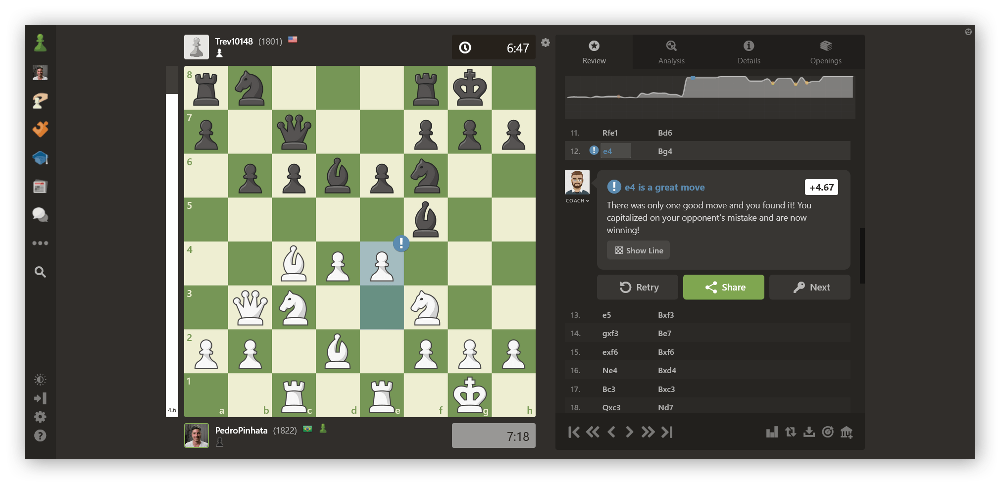


duidelijk gaat er iets fout met  de kwaliteit van de image en ook de resultaten die niet goed zijn

---

### predict.py -output op originele afbeelding

**Wat:** de standalone modus in `predict.py` tekent de bounding boxes nu op de originele afbeelding in plaats van op de verkleinde 224×224 versie. De afbeelding wordt gesplitst in twee stappen: `_load_original()` laadt het origineel op volledige resolutie, `_preprocess_for_model()` maakt een aparte 224×224 kopie puur voor de modelinvoer. De voorspelde boxcoördinaten, die in 224×224 ruimte terugkomen, worden via `_scale_boxes()` teruggeschaald naar de originele afbeeldingsdimensies. De figuurgrootte in de output past zich automatisch aan op basis van de originele breedte en hoogte.

**Waarom:** het model verwacht altijd 224×224 als invoer, maar die resolutie is alleen bedoeld voor het model -het is niet de juiste schaal om resultaten op te presenteren. Bij een grote inputafbeelding stonden de boxes op de 224×224 thumbnail, waardoor de output niet overeenkwam met de afbeelding die als input was meegegeven. Bovendien gingen bij het terugschalen naar de outputweergave positiefouten verloren die visueel pas zichtbaar zijn op de originele resolutie. Door het origineel te bewaren en de boxcoördinaten terug te schalen via de verhouding `orig_dim / 224`, kloppen de boxes op de afbeelding die de gebruiker herkent als input.


de output is beter maar  de prediction zijn nog off. Mogelijk doordat het model getrained is op puur een foto van het bord. een mogelijke oplossing is met op cv het bord als kandidaat te detecteren
---

## Dag 6 -23/03/26

### board_detector.py -automatisch schaakbord detecteren in willekeurige afbeeldingen

**Wat:** een nieuw los bestand `board_detector.py` is aangemaakt dat met OpenCV het schaakbord automatisch uit een willekeurige afbeelding knipt. De functie `crop_board()` converteert de afbeelding naar grijswaarden, past Gaussian blur en Canny edge detection toe en zoekt vervolgens de grootste vierhoekige contour -dat is in vrijwel alle gevallen het bord. Die contour wordt via een perspectief-transformatie rechtgetrokken tot een vierkante top-down weergave. Het bestand is zowel standalone bruikbaar (`python board_detector.py --image screenshot.png`) als importeerbaar vanuit andere bestanden. In `predict.py` is een `--detect` flag toegevoegd die `crop_board()` aanroept vóór de modelinferentie, zodat beide stappen in één commando gecombineerd kunnen worden:

**Waarom:** het model is getraind op geïsoleerde schaakbordafbeeldingen zonder omgeving eromheen. Een screenshot van chess.com of een foto van een bord op tafel bevat altijd extra context -UI-elementen, achtergrond, een hand -die het model niet kent en ook niet nodig heeft. Als die context niet weggeknipt wordt, verspilt het model gridcellen aan regio's buiten het bord en worden er detecties op de verkeerde locaties gemeld. Door het bord eerst te isoleren via contourdetectie en perspectief-correctie krijgt het model exact dezelfde soort input als waarmee het getraind is. De keuze voor contourdetectie is bewust simpel gehouden: een schaakbord is de meest prominente rechthoekige structuur in vrijwel elke boardgame-screenshot, wat de aanpak robuust maakt zonder complexe modellen nodig te hebben.

### Testresultaten board_detector op chess.com screenshot

De volgende vier afbeeldingen zijn gegenereerd met `python predict.py --image test1.png --detect`.

**Edges**
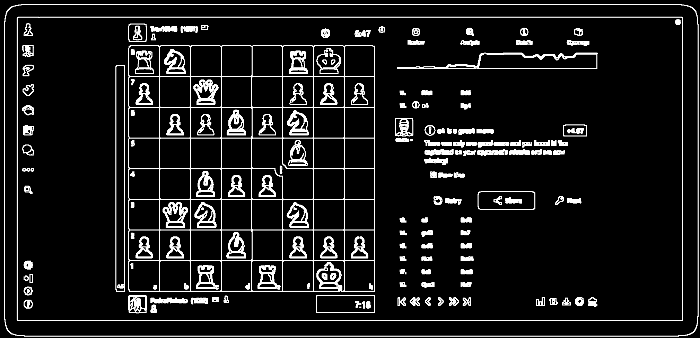
> De Canny edge detectie vindt alle randen in de screenshot -schaakstukken, UI-knoppen, het bord zelf en de achtergrond. De boardrand is duidelijk zichtbaar als een prominente rechthoek in het midden-links van het beeld.

**Contour**

> De groene rechthoek toont het gedetecteerde bord. De contourdetectie heeft het bordgebied correct gevonden -de vier rode hoekpunten zitten op de juiste hoeken van het schaakbord. De UI van chess.com rondom het bord wordt genegeerd.

**Geknipt bord**
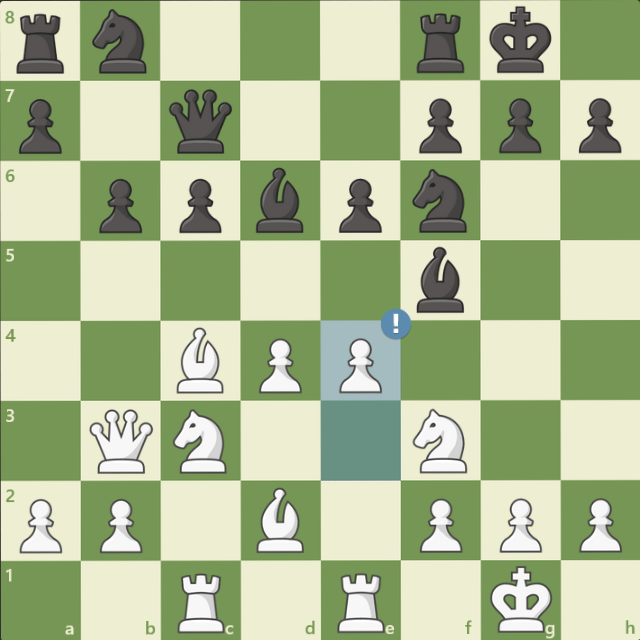
> Het uitgeknipte bord na perspectief-correctie. Het bord is schoon geïsoleerd zonder UI-elementen eromheen. De schaal en oriëntatie kloppen -dit is exact het soort input waarop het model getraind is.

**Eindresultaat met detecties**
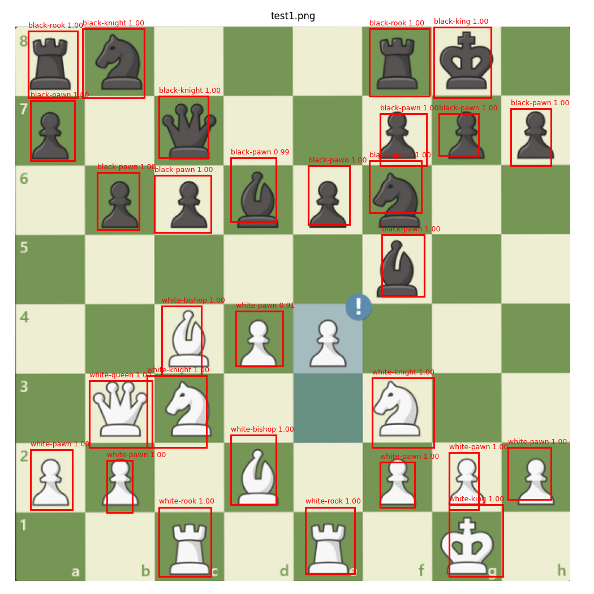
> De meeste stukken worden correct gedetecteerd met confidence 1.00. Een aantal observaties over wat nog niet klopt:
> - De meeste stukken worden wel gevonden maar de klasselabels kloppen niet altijd. Zo worden sommige zwarte pionnen gelabeld als `black-knight` en omgekeerd.
> - In het midden van het bord staat een blauw uitroepteken van de chess.com UI dat na het uitknippen nog zichtbaar is op het bord. Dit valt in een cel die het model probeert te classificeren, wat tot een foutieve detectie kan leiden.
> - Niet alle stukken worden gedetecteerd -een deel mist nog een bounding box.
> - De borddetectie zelf werkt goed.

---

## Dag 7 -24/03/26

### Resolutie verhoogd naar 640×640 + model aangepast

**Wat:** de inputresolutie is verhoogd van 224×224 naar 640×640. `GRID_S` is aangepast van 14 naar 20, zodat de feature map na vijf MaxPool-lagen (640→320→160→80→40→20) overeenkomt met de gridgrootte. In het model is een vijfde MaxPooling laag toegevoegd na block 5, waardoor de feature map van 40×40 naar 20×20 gaat. `BATCH_SIZE` is verlaagd van 16 naar 8 vanwege de hogere geheugenbelasting per afbeelding.

**Waarom:** de originele afbeeldingen in de dataset zijn 640×640. Tot nu toe werden die verkleind naar 224×224 voordat ze in het model gingen -dat betekent dat ruim 70% van de beeldinformatie verloren ging nog voor het model er iets mee kon doen. Bij 224×224 is een schaakstuk gemiddeld zo'n 25 pixels breed. Bij 640×640 is datzelfde stuk 80 pixels breed, wat de conv-lagen aanzienlijk meer detail geeft om mee te werken. Het grid van 20×20 geeft 400 cellen voor maximaal 32 stukken, dus botsingen in dezelfde cel komen vrijwel niet voor. De w/h-schaalfactor van 7 blijft ongewijzigd -breedte en hoogte zijn fracties van de totale afbeelding, en die verhoudingen veranderen niet door de resolutie omhoog te gooien.

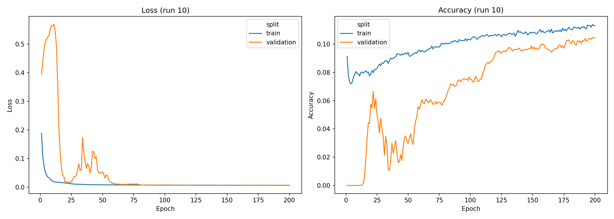
> De trainloss daalt snel naar bijna 0 voor epoch 25. De validatieloss stabiliseert rond 0.5 -er is een duidelijk gat tussen train en validatie, wat op overfitten wijst. De accuracy staat rond 10% voor beide splits. Die lage waarde is misleidend: bij een 20×20 grid zijn er 400 cellen per afbeelding waarvan er maximaal 32 een stuk bevatten. De Keras accuracy telt alle outputwaarden mee als getal, niet als classificatie per stuk. De werkelijke prestatie zit in de mAP.


> De diagonaal is bijna perfect voor alle klassen. `black-pawn` (139), `white-pawn` (124), `white-queen` (51) en `black-rook` (50) scoren het hoogst. Alleen `black-bishop` wordt in een paar gevallen verward met `black-pawn`. Dit is de sterkste confusion matrix tot nu toe.

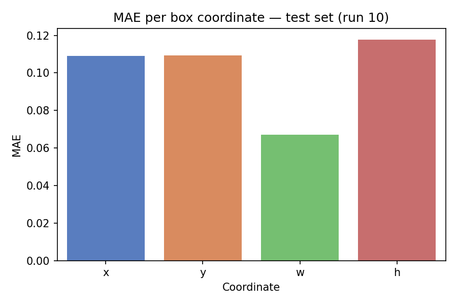
> x ≈ 0.110, y ≈ 0.110 -iets hoger dan run 6 (0.072). w ≈ 0.067 en h ≈ 0.119, beide beter dan run 8. De hogere x/y fout in genormaliseerde ruimte is deels verwacht: 0.11 cel-relatief bij een celgrootte van 640/20 = 32px geeft ~3.5px verschuiving, tegenover ~1.1px bij de 16px cellen van run 6. De stukken zijn zelf ook groter, dus de verhouding is vergelijkbaar.

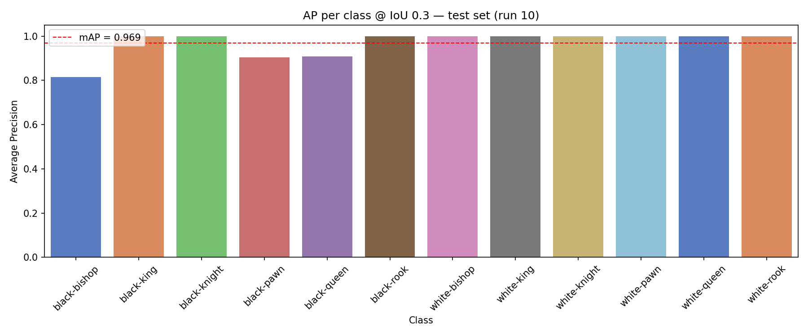
> mAP = 0.969 bij IoU 0.3 -de hoogste waarde tot nu toe. Bijna alle klassen scoren op of boven 0.95. Alleen `black-bishop` zit iets lager, wat overeenkomt met de verwarring met `black-pawn` in de confusion matrix. De sprong van 0.904 (run 7) naar 0.969 bevestigt dat de hogere resolutie een directe verbetering geeft.

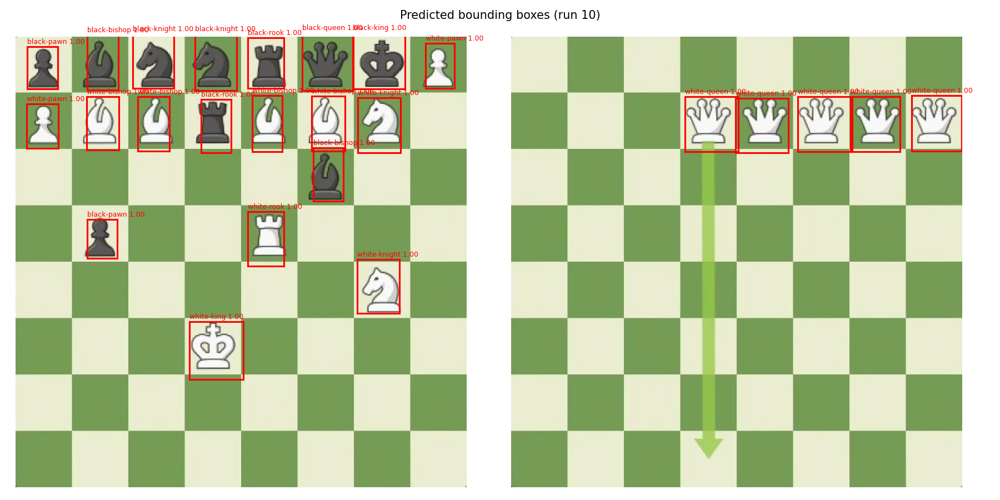
> Op de eerste afbeelding worden de meeste stukken correct gedetecteerd. Een handvol stukken mist nog een bounding box. Op de tweede afbeelding -een  Queensworden zes stukken correct opgepikt. De pijloverlays uit de dataset worden genegeerd.

### Test op chess.com screenshot (run 10)

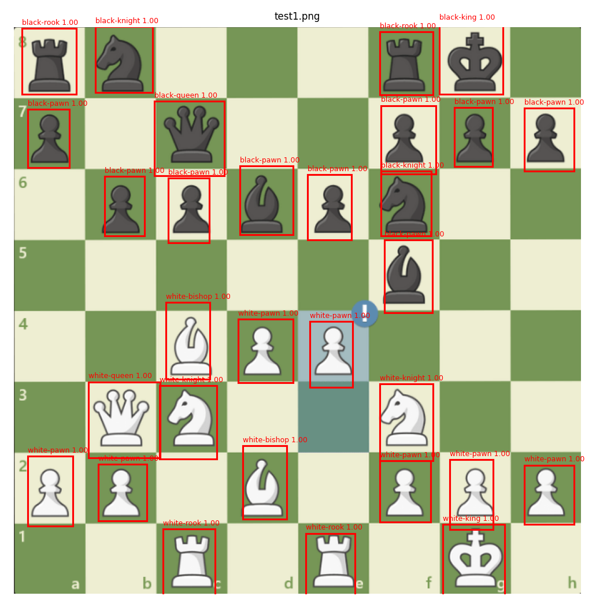
> Vrijwel elk stuk wordt correct gedetecteerd met confidence 1.00. Zwarte en witte stukken worden goed van elkaar onderscheiden. Het enige probleem is dat `black-bishop` consequent als `black-pawn` wordt gelabeld met 100% confidence. Alle andere klassen kloppen.

**Conclusie:** de stap naar 640×640 heeft de mAP verhoogd van 0.904 naar 0.969. De accuracy van ~10% zegt niets over de detectiekwaliteit - dat is een bijwerking van de gridstructuur en hoe Keras accuracy berekent over continue sigmoid outputs. Het enige resterende probleem is de verwarring tussen `black-bishop` en `black-pawn`, waarschijnlijk doordat beide stukken donker zijn en in de trainingdata visueel op elkaar lijken.

---

## Dag 8 - 24/03/26

### Hogere class weight voor black-bishop

**Wat:** `CLASS_WEIGHT_OVERRIDES` toegevoegd aan `config.py` met een extra vermenigvuldiger van ×3.0 voor `black-bishop`, bovenop de automatisch berekende inverse-frequency weight. In `train.py` wordt dit toegepast na de reguliere gewichtsberekening. `RUN_ID` verhoogd naar 11.

**Waarom:** in run 10 werd `black-bishop` consequent als `black-pawn` geclassificeerd. Beide stukken zijn donker van kleur en lijken in sommige stijlen op elkaar. De automatische class weight compenseert al voor de klasse-onbalans, maar kennelijk niet genoeg om het model de vormverschillen te laten leren. Door de weight handmatig extra op te schalen weegt een fout op een bishop zwaarder mee in de loss, wat het model dwingt meer aandacht aan dat onderscheid te besteden.

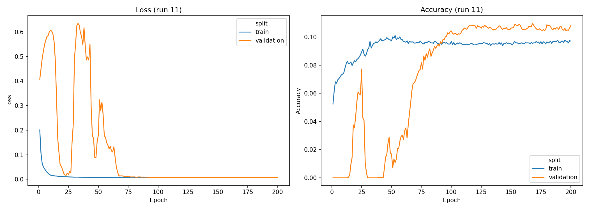
> Loss daalt snel naar bijna 0 voor train. Validatieloss daalt maar heeft een spike rond epoch 50-75, waarna hij weer stabiliseert rond 0.4-0.5. Dit is waarschijnlijk het moment dat `ReduceLROnPlateau` de learning rate verlaagt. Accuracy blijft rond 10% - zelfde reden als run 10.


> `black-bishop` scoort nu 32 correct met 2 fout naar `black-pawn` - was 30 correct en 4 fout in run 10. Verbetering maar niet volledig opgelost. Alle andere klassen zijn perfect of vrijwel perfect.

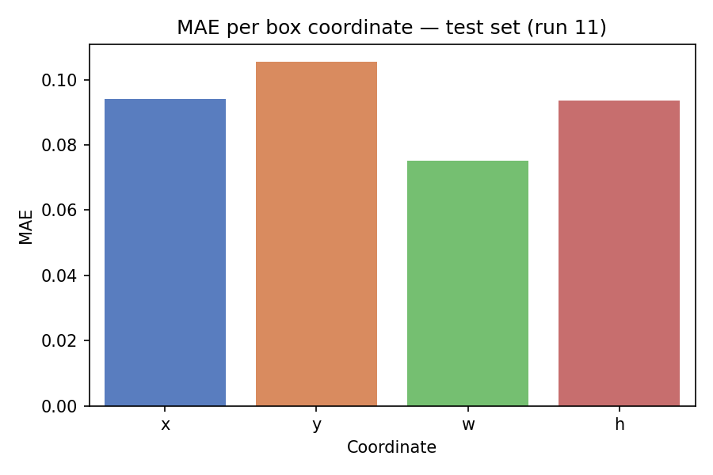
> Alle coordinaten verbeterd ten opzichte van run 10. x: 0.094 (was 0.110), y: 0.105 (was 0.110), w: 0.075 (was 0.067), h: 0.094 (was 0.119). De hogere class weight heeft de lokalisatie niet verslechterd.

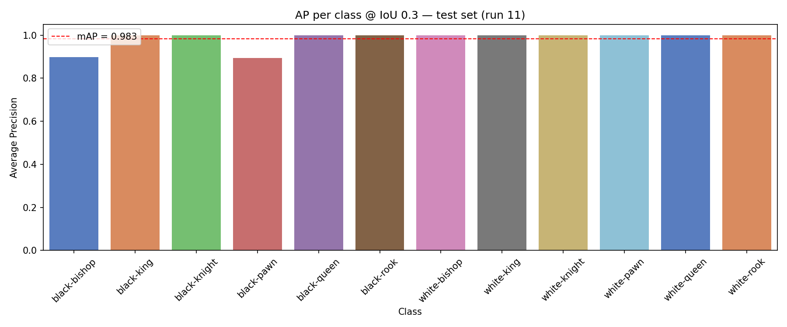
> mAP = 0.983 - gestegen van 0.969. `black-bishop` is nog steeds de laagste klasse maar duidelijk hoger dan in run 10.


>

### Test op chess.com screenshot (run 11)


> Een van de twee bishops wordt nu correct gelabeld als `black-bishop`. De andere wordt nog steeds als `black-pawn` geclassificeerd. De blauwe `!` van de chess.com UI wordt nog steeds als stuk gedetecteerd - het model ziet een donker object op een cel en classificeert het, wat correct gedrag is vanuit het model gezien. Alle overige stukken kloppen.

**Conclusie:** de ×3.0 multiplier heeft geholpen maar het bishop-probleem half opgelost. Volgende stap is de weight verder verhogen of overstappen op data augmentatie als structurele fix.

### Data augmentatie - horizontale flip + brightness jitter

**Wat:** `augment()` toegevoegd aan `preprocessing.py`. Elke trainingsafbeelding wordt horizontaal gespiegeld en er wordt een brightness-gevarieerde kopie van de gespiegelde versie aangemaakt (factor ×0.75-1.25). De trainingsset wordt hierdoor 3x zo groot. Augmentatie wordt alleen op traindata toegepast, niet op validatie of test. `RUN_ID` verhoogd naar 12.

**Waarom:** de class weight aanpassing in run 11 loste het bishop-probleem maar half op. De hypothese was dat het model te weinig visuele variatie heeft gezien voor `black-bishop` - door augmentatie krijgt het model dezelfde stukken in meer variaties te zien, wat het onderscheid met `black-pawn` zou moeten verbeteren via vormherkenning in plaats van kleur.

**Resultaat:** de augmentatie heeft het probleem niet opgelost. `black-bishop` wordt nog steeds consequent als `black-pawn` geclassificeerd. Dit wijst erop dat het probleem dieper zit dan variatie in belichting of spiegeling - de visuele stijl van de chess.com bishop lijkt voor het trainen en classificeren bij sommige images niet correct wil doen

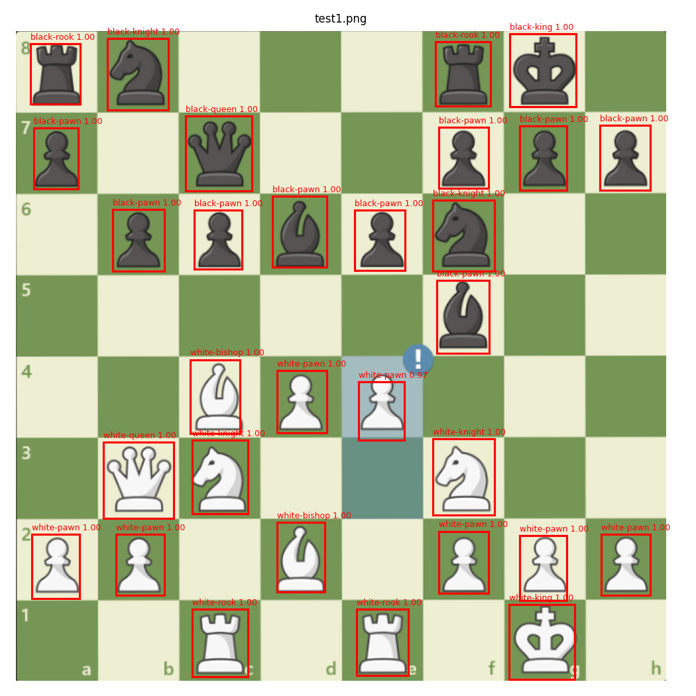

---

## Dag 9 - 26/03/26

### Classificator - opzet en implementatie

**Context:** na run 12 blijft `black-bishop` hardnekkig verward worden met `black-pawn`. Class weights, augmentatie en extra trainingsruns hebben het probleem niet volledig opgelost. De hypothese is dat de detector én de classifier tegelijk te veel verantwoordelijkheid dragen -het model moet per gridcel zowel de positie als het type bepalen. Door classificatie los te trekken als een aparte tweede stap kan een dedicated model zich uitsluitend richten op het onderscheid tussen de 12 klassen zonder rekening te houden met bounding boxes of gridstructuur.

**Aanpak:** de bestaande detector vindt de stukken. De classificator krijgt alle geknipt patches in één batch binnen en geeft per patch een klasselabel terug. Alle gedetecteerde crops worden gestapeld tot een array `(N, 64, 64, 3)` en in één `model.predict()` aanroep verwerkt -dit is efficiënter dan elk stuk apart door het model halen omdat de matrix-operaties in de Conv-lagen parallel lopen.

De code staat in de map `classificator/` en heeft een eigen `RUN_ID`, een eigen outputstructuur en deelt alleen de onderliggende datasets met het hoofdproject.

---

### classificator/config.py

Eigen configuratie los van de root `config.py`. Dezelfde `RUN_ID`-structuur als het hoofdproject: `PLOTS_DIR` wijst naar `classificator/outputs/plots/run{RUN_ID}/` en het model wordt opgeslagen als `classifier_run{RUN_ID}.h5`. Dataset-paden worden opgebouwd via `ROOT_DIR` zodat de locatie van de datasets niet hoeft te veranderen als de `classificator/` map verplaatst wordt.

| Instelling | Waarde | Waarom |
|------------|--------|--------|
| `PATCH_SIZE` | 64 | Een uitgeknipte patch bevat nauwelijks achtergrond -64×64 is groot genoeg voor vormdetails en klein genoeg voor snelle training |
| `BATCH_SIZE` | 32 | Standaard voor kleine modellen; past ruim in geheugen bij 64×64 patches |
| `EPOCHS` | 30 | Classificatie convergeert sneller dan objectdetectie -30 epochs is een startpunt |

---

### classificator/data_loader.py

Laadt de CSV-annotaties direct uit de bestaande datasets en knipt per bounding box een patch uit het originele beeld. De annotatieparsing is opnieuw geïmplementeerd in plaats van geïmporteerd uit de root `data_loader.py` -een directe import zou een naamconflict geven omdat Python anders de verkeerde `config.py` laadt.

| Onderdeel | Waarom |
|-----------|--------|
| `cv2.imread()` | Laadt de originele afbeelding op volledige resolutie zodat de crop niet extra vervormd wordt door een eerdere resize |
| `cv2.cvtColor(BGR→RGB)` | OpenCV laadt beelden standaard in BGR-volgorde; het model verwacht RGB zodat kleuren correct worden geleerd |
| Array-slice `img[y1:y2, x1:x2]` | Direct uitknippen op de numpy array is sneller dan een aparte OpenCV-functie |
| `cv2.resize()` naar 64×64 | Bounding boxes variëren in grootte; het model verwacht een vaste inputdimensie |
| Normalisatie `/255.0` | Schaalt pixelwaarden naar \[0, 1\]; grote inputwaarden verstoren activaties in vroege lagen |
| `plot_patch_verification()` | Slaat een grid op met voorbeeldpatches per klasse -controlemiddel om te zien of crops correct zijn uitgeknipt en gelabeld voordat het model traint |
| `plot_class_distribution()` | Zelfde als in het hoofdproject: inzicht in klasse-imbalans voor de patch-dataset |

---

### classificator/model.py

Simpel CNN voor classificatie. Geen gridoutput, geen bounding box regressie -alleen een softmax over 12 klassen.

| Laag | Waarom |
|------|--------|
| Conv2D 32 filters, 3×3, ReLU | Leert basale vormen en randen in de 64×64 patch; 32 filters is genoeg voor zo'n kleine input |
| MaxPooling 64→32 | Verkleint de feature map met factor 2; maakt het netwerk minder gevoelig voor kleine positieverschuivingen in de crop |
| Conv2D 64 filters, 3×3, ReLU | Leert specifiekere vormen op basis van de eerder geleerde patronen |
| MaxPooling 32→16 | Zelfde reden als eerste pooling |
| Flatten | Zet de 16×16×64 feature map om naar een 1D vector van 16.384 waarden zodat de Dense lagen ermee kunnen werken |
| Dense 128, ReLU | Combineert de features tot een compacte representatie vóór de eindclassificatie |
| Dense 12 + softmax | Eindlaag met één neuron per klasse; softmax zorgt dat de outputs optellen tot 1 zodat ze als kansen geïnterpreteerd worden |

---

### classificator/train.py

Standaard Keras training, geen custom loss, geen callbacks.

| Onderdeel | Waarom |
|-----------|--------|
| `optimizer='adam'` | Standaard Adam zonder aangepaste learning rate -de Keras default van `1e-3` is het startpunt; aanpassen als de trainingscurve instabiliteit toont |
| `loss='sparse_categorical_crossentropy'` | Standaard loss voor multi-class classificatie waarbij labels integers zijn in plaats van one-hot vectoren. Geen custom loss nodig: er is geen locatiecomponent, het model hoeft alleen de juiste klasse te voorspellen |
| `metrics=['accuracy']` | Directe metric voor classificatie -bij een gebalanceerde patch-dataset is accuracy hier informatief, anders dan bij de griddetectie waar accuracy misleidend was |

De trainingscurve (loss + accuracy voor train en validatie) wordt opgeslagen als `training_run{RUN_ID}.png` in dezelfde stijl als het hoofdproject.

---

### classificator/evaluate.py

Evalueert het getrainde model op de testset en slaat een confusion matrix op als `confusion_matrix_run{RUN_ID}.png`. Alle patches worden in één batch door `model.predict()` gestuurd, de argmax geeft het voorspelde klasselabel. Zelfde opmaak en naamgeving als de root `evaluate.py`.

---

### classificator/main.py

Orkestreert de volledige pipeline in volgorde: data laden → patch verificatie opslaan → class distributie opslaan → model bouwen → trainen → confusion matrix opslaan. Output gaat naar `classificator/outputs/plots/run{RUN_ID}/` en `classificator/outputs/models/` zodat runs niet door elkaar lopen met het hoofdproject.

---

### classificator/predict.py - predict pipeline (run 15)

**Wat is gebouwd:** een volledige predict-pipeline die een willekeurige schaakbord-screenshot als input neemt en per cel het aanwezige stuk classificeert. De aanpak wijkt fundamenteel af van de oude grid-detector: in plaats van het hele beeld door een CNN te sturen dat tegelijkertijd positie en klasse moet bepalen, wordt het probleem opgesplitst in drie losse stappen die elk een specifieke taak hebben. Dit maakt het systeem makkelijker te debuggen en te verbeteren.

**De vijf stappen uitgelegd:**

**Stap 1 - Board detection**
`board_detector.crop_board_debug()` zoekt het schaakbord in het inputbeeld via Canny edge detection en contour-analyse. Canny markeert scherpe kleurovergangen als witte pixels. De code zoekt vervolgens naar de grootste rechthoekige contour in het beeld - dat is het bord. Met `getPerspectiveTransform` wordt de gevonden rechthoek rechtgetrokken naar een vlak 512x512 vierkant, ook als de foto schuin is genomen. Zonder deze correctie zouden de 64 cellen scheef worden uitgeknipt en zou de classifier op verkeerde pixels classificeren.

**Stap 2 - Cell splitting**
Het 512x512 bord wordt mechanisch opgedeeld in 64 gelijke cellen van elk 64x64 pixels (8 rijen x 8 kolommen). Dit werkt alleen correct als stap 1 een goed rechtgetrokken bord heeft opgeleverd - een scheef bord geeft scheefgesneden cellen.

**Stap 3 - Piece detection per cel (voor de classifier)**
Dit is de meest kritieke stap. Een classifier moet altijd een klasse kiezen - als elke lege cel ook door het model gaat, krijg je altijd 64 voorspellingen, ook voor lege velden. Dat zijn gegarandeerde false positives. Daarom wordt eerst per cel gecontroleerd of er visueel iets aanwezig is via twee onafhankelijke checks:

- **Edge density check (Canny):** de cel wordt in grijswaarden omgezet en licht geblurred om ruis te dempen. Dan past Canny edge detection de drempel toe op 30-100. Het percentage edge-pixels wordt berekend. Een lege schaakcel is visueel vlak (alleen de kleur van het veld), een stuk heeft duidelijke contouren en interne lijnen. Drempel: als meer dan 6% van de pixels een edge is, wordt de cel als bezet gemarkeerd.

- **Adaptive threshold blob check (center crop):** soms heeft een donker stuk op een donker veld weinig Canny-edges omdat het contrast laag is. Daarom wordt ook de centrale 75% van de cel apart geanalyseerd met een adaptieve threshold. Adaptive threshold berekent per klein pixelblok wat de lokale drempel is - dit werkt beter dan een globale drempel bij variabele belichting. Het resultaat is een zwart-wit beeld waar objecten als witte blobs verschijnen. Als een contour groter is dan 4% van het centrumoppervlak telt dat als stuk.

Beide checks zijn onafhankelijk: als een van de twee positief is, wordt de cel als bezet beschouwd.

**Stap 4 - Classificatie**
Alleen de als bezet gemarkeerde cellen worden als batch door het classifier-model gestuurd. Ze worden eerst geresized naar `PATCH_SIZE x PATCH_SIZE` en genormaliseerd naar [0,1]. Alle patches worden gestapeld tot een array en in één `model.predict()` aanroep verwerkt - dit is efficiënter dan elke patch apart door het model te sturen.

**Stap 5 - Output**
Het resultaat wordt getekend over het gecropte bord. Per bezette cel wordt de 2-lettercode van het stuk en de confidence score getoond. De confidence komt rechtstreeks uit de softmax-output: een waarde dichtbij 1.0 betekent dat het model zeker is, een waarde rond 0.5 betekent dat het model twijfelt tussen meerdere klassen.

**Debug output:** alle tussenliggende beelden worden opgeslagen in `classificator/outputs/plots/run15/` zodat het gedrag van elke stap los te controleren is zonder opnieuw te runnen.

---

#### Board detection debug (run 15)


> Canny edge-beeld van het inputplaatje. Elke witte pixel is een gedetecteerde rand. Het bord is herkenbaar als een duidelijk rechthoekig patroon. De code zoekt naar de grootste vierhoekige contour in dit beeld om de hoekpunten van het bord te bepalen.

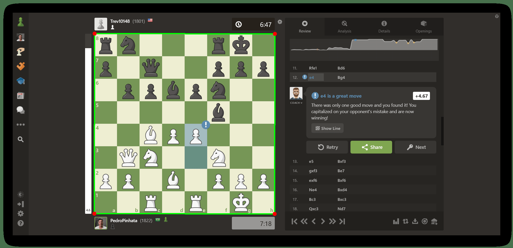
> Het gedetecteerde bord-quadrilateraal getekend over het originele beeld. De groene lijn toont de gevonden contour. De rode stippen zijn de vier hoekpunten die worden doorgegeven aan `getPerspectiveTransform`. Als de stippen niet precies in de hoeken van het bord zitten, zal de crop scheef zijn.


> Het gecropte en perspectief-gecorrigeerde bord (512x512 pixels). De perspectief-transformatie trekt het bord recht zodat alle 64 cellen exact even groot zijn na de splitsing. Dit is de directe input voor stap 2.

---

#### Cel-detectie debug (run 15)

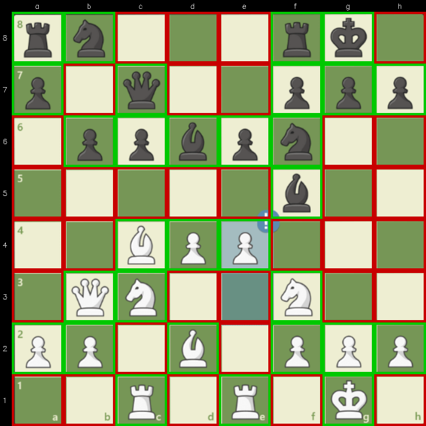
> Alle 64 cellen als 8x8 grid met het resultaat van de piece-detection stap. Groene rand = cel gemarkeerd als bezet en doorgestuurd naar de classifier. Rode rand = cel gemarkeerd als leeg en overgeslagen. Dit is het meest directe overzicht om te zien of de detectie correct werkt - te veel groene cellen op lege velden betekent dat de drempelwaarden te laag zijn.


> De Canny edge-afbeelding per cel zoals het algoritme die intern ziet bij de edge density check. Cellen met een stuk tonen duidelijke witte lijnen langs de contouren van het stuk. Lege cellen zijn vrijwel geheel zwart omdat een vlak schaakbordveld weinig scherpe overgangen heeft. De gekleurde rand geeft het eindoordeel: groen als de cel bezet is bevonden, rood als leeg.

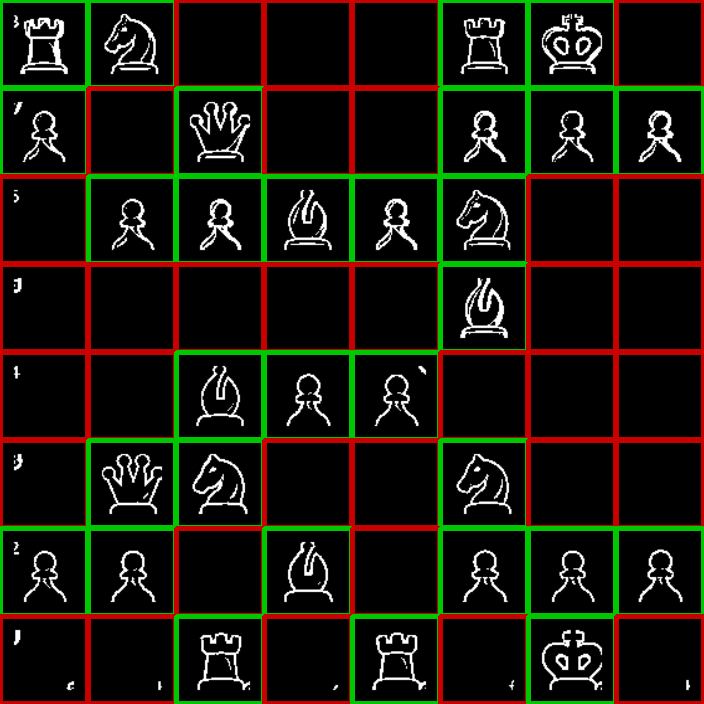
> De adaptive threshold-afbeelding per cel, gebruikt als tweede check naast de edge density. Alleen het centrale 75% van de cel wordt geanalyseerd om ruis aan de celranden te vermijden - die randen zijn namelijk onderdeel van het schaakbordpatroon zelf en geen stukken. Witte blobs in het midden wijzen op de aanwezigheid van een stuk. Dit vangt met name donkere stukken op donkere cellen die weinig Canny-edges produceren.

---

#### Eindresultaat (run 15)


> Het eindresultaat van de volledige pipeline. Per bezette cel staat de 2-lettercode van het voorspelde stuk (bb = black bishop, wp = white pawn, etc.) en de bijbehorende confidence. Cellen zonder stuk krijgen geen label. Dit is run 15 - het eerste werkende prototype van de cel-classifier aanpak.

---

## Run 16 - classificator

**Wat is veranderd en waarom:**

Run 15 was een werkend prototype met een klein model getraind op 64x64 patches in 30 epochs. Run 16 is de eerste serieuze poging om de nauwkeurigheid te verhogen door drie dingen tegelijk aan te pakken: grotere input, dieper netwerk en langer trainen.

| Instelling | Run 15 | Run 16 | Reden |
|------------|--------|--------|-------|
| `PATCH_SIZE` | 64 | 80 | Meer pixels per patch = meer detail per stuk |
| Conv blokken | 2 | 3 (32 - 64 - 128) | Dieper netwerk kan complexere vormen leren |
| Dense | 128 | 256 | Grotere feature vector door dieper netwerk, Dense moet meescalen |
| Dropout | nee | 0.3 voor Dense | Langer trainen vergroot kans op overfitting; Dropout corrigeert dit |
| `BATCH_SIZE` | 32 | 16 | Kleinere batches geven ruisigere gradients, wat generalisatie licht verbetert |
| `EPOCHS` | 30 | 100 | Met een dieper model en grotere input duurt convergentie langer |

**Over PATCH_SIZE 64 naar 80:** een schaakstuk op een 64x64 patch bevat weinig pixels voor de fijnere details zoals de vorm van een bisschopsmijter versus een pion. Op 80x80 heeft het model meer pixels beschikbaar om onderscheid te maken. Dit is direct relevant voor het `black-bishop` vs `black-pawn` probleem dat door alle vorige runs heen speelt.

**Over het derde conv blok:** in run 15 was de architectuur Conv(32) -> Pool -> Conv(64) -> Pool -> Flatten. Na twee pooling-stappen is de feature map 16x16. Op 80x80 input levert dat Conv(32) -> Pool(40) -> Conv(64) -> Pool(20) -> Conv(128) -> Pool(10) -> Flatten. Het extra blok kan op de 20x20 feature map nog specifiekere patronen leren voordat de informatie wordt samengevat. 128 filters in het derde blok is logisch: elk dieper blok leert complexere patronen en heeft daarvoor meer filters nodig.

**Over Dropout 0.3:** Dropout zet tijdens het trainen willekeurig 30% van de neuronen in de Dense laag op nul per batch. Dit dwingt het netwerk om niet te leunen op een kleine groep neuronen maar de informatie te spreiden over het hele netwerk. Bij 100 epochs zonder Dropout zou het model de trainingsset kunnen memoriseren in plaats van generaliseren naar nieuwe beelden.

---

### Trainingscurve (run 16)

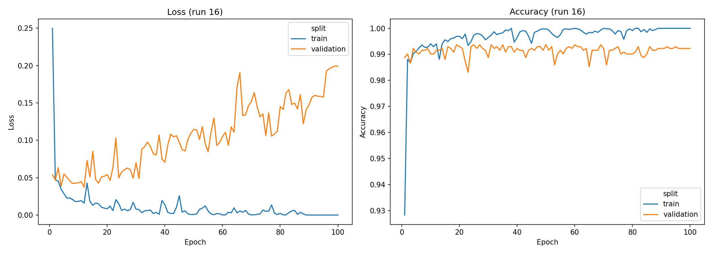
> De trainings- en validatiecurve voor loss en accuracy over 100 epochs. Een goed verlopende run laat beide curves dalen en stijgen in dezelfde richting zonder grote kloof ertussen. Een grote kloof tussen train en validatie duidt op overfitting.

### Confusion matrix (run 16)

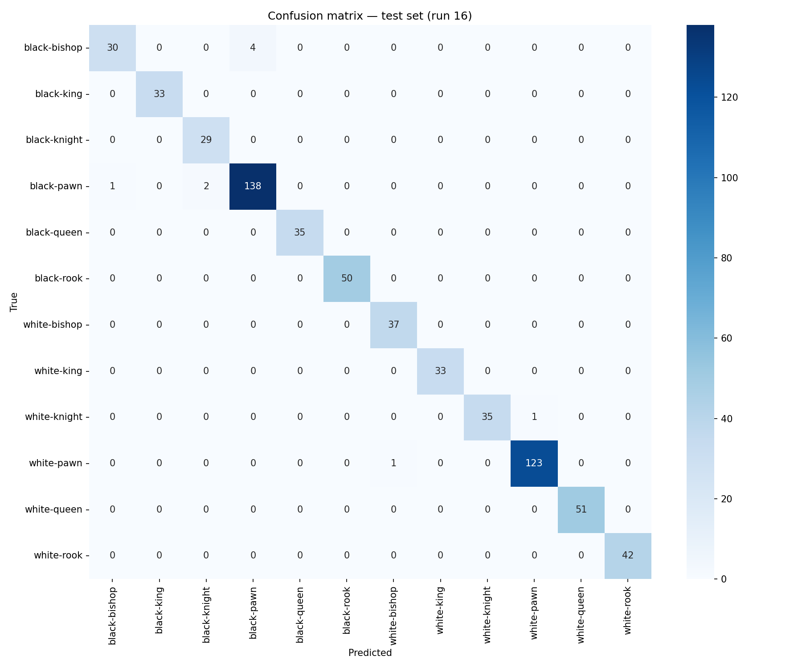
> De confusion matrix toont voor elke combinatie van werkelijk label (rijen) en voorspeld label (kolommen) hoeveel testpatches er in die cel vallen. De diagonaal zijn correcte voorspellingen - hoe donkerder de diagonaal en hoe lichter de rest, hoe beter. Klassen die verward worden zijn zichtbaar als verhoogde waarden buiten de diagonaal.

### Test op chess.com screenshot (run 16)

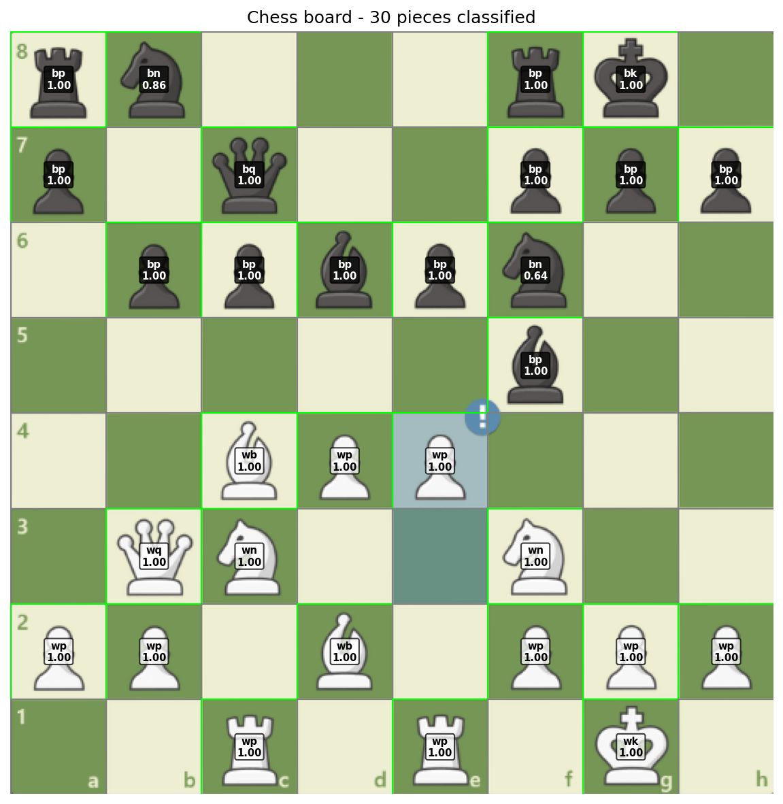
> Eindresultaat van de predict-pipeline op een chess.com screenshot. Vergelijken met run 15 laat zien of de verbeteringen in het model ook doorwerken op een echt bord dat niet uit de trainingsset komt.

---

## Run 17 - classificator

**Wijzigingen ten opzichte van run 16:**

| Instelling | Run 16 | Run 17 | Reden |
|------------|--------|--------|-------|
| Activatie | ReLU | LeakyReLU (alpha=0.1) | ReLU kan neuronen permanent uitzetten bij negatieve input (dying ReLU); LeakyReLU laat een klein signaal door zodat neuronen actief blijven |
| ModelCheckpoint | nee | ja, op `val_accuracy` | Slaat het beste model op tijdens training in plaats van het laatste; beschermt tegen overfitting aan het eind van de run |
| `EPOCHS` | 100 | 150 | Meer ruimte voor het model om te convergeren nu checkpoint het beste moment bewaard |

**LeakyReLU uitgelegd:** standaard ReLU geeft 0 terug voor alles kleiner dan 0. Als een neuron consequent negatieve input krijgt, leert het niets meer - het gradient is 0 en de gewichten worden niet meer bijgewerkt. Dit heet een "dead neuron". LeakyReLU geeft bij negatieve input een kleine waarde terug (0.1 × input) zodat het gradient nooit volledig nul wordt en alle neuronen blijven bijdragen aan het leerproces.

---

### Trainingscurve (run 17)

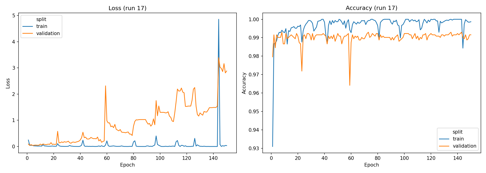
> De loss laat grote pieken zien rond epoch 60 en epoch 130. Dit duidt op instabiliteit in de learning rate - het model schiet voorbij een goed minimum. De ModelCheckpoint heeft desondanks het beste moment opgeslagen. De accuracy blijft hoog (boven 0.97) voor zowel train als validatie, wat aangeeft dat het model de patches goed leert classificeren.

### Class distributie trainingsdata (run 17)


> Dit is de kern van het bishop-probleem. `black-pawn` heeft 925 trainingssamples, `black-bishop` slechts 250 - een factor 3.7 verschil. Het model ziet tijdens training bijna 4x zo vaak een pion als een bisschop. Bij twijfel trekt het model daardoor altijd naar de meerderheidsklasse. Dit verklaart waarom de black-bishop consequent als black-pawn wordt geclassificeerd, ook na architectuur- en hyperparameter-aanpassingen.

### Confusion matrix (run 17)


> Op de testset: 31 van de ~34 black-bishops correct, 3 fout geclassificeerd als black-pawn. Op de trainingsdata presteert het model goed, maar op chess.com screenshots is de fout groter omdat de visuele stijl van de stukken verschilt van de trainingsdata. De pion-rij laat ook 3 patches zien die als bishop worden geclassificeerd, wat symmetrisch is - beide klassen trekken naar elkaar toe.

### Patch verificatie (run 17)

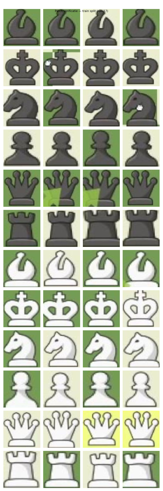
> Voorbeeldpatches per klasse uit de trainingsset. Rij 1 (black-bishop) toont donkere stukken met een puntige bovenkant - de bisschopsmijter. Rij 4 (black-pawn) toont kleinere donkere stukken met een ronde bovenkant. Visueel lijken ze op elkaar wanneer het bord laagresolutie is of de stijl afwijkt van de trainingsdata (zoals bij chess.com).

### Test op chess.com screenshot (run 17)


> De meeste stukken worden correct geclassificeerd. De black-bishop linksboven (a8) wordt nog steeds als `bp` (black-pawn) geclassificeerd met 0.80 confidence. De chess.com UI-knop (blauwe `!`) wordt ook nog steeds als stuk gedetecteerd - de piece-detection ziet het als een object maar het model classificeert het als pion.

---

### Analyse: waarom black-bishop blijft falen

Het probleem heeft twee oorzaken die elkaar versterken:

**1. Data-imbalans (hoofdoorzaak):** black-pawn heeft 925 trainingssamples, black-bishop 250. Het model wordt tijdens training 3.7x zo vaak gecorrigeerd op pion-fouten als op bishop-fouten. De loss-functie geeft elke klasse gelijk gewicht per sample, waardoor het model automatisch beter wordt in het herkennen van de meerderheidsklasse.

**2. Visuele stijlkloof:** de trainingsdata bevat schaakstukken in een specifieke cartoon-stijl. Chess.com gebruikt een andere visuele stijl. Een black-bishop in de trainingsdata heeft een duidelijke puntige mijter; in de chess.com stijl is dat detail subtieler of anders weergegeven. Het model heeft die chess.com stijl nooit gezien tijdens training.

**Fix voor run 18:** class weights toevoegen aan de loss-functie. Een class weight van 925/250 = 3.7 voor black-bishop compenseert de imbalans exact - elke bishop-fout weegt dan even zwaar als 3.7 pion-fouten in de loss. Dit is een directe, mathematisch verantwoorde correctie zonder extra data of architectuurwijzigingen.

---

## classificator/live.py - live schermdetectie

**Wat:** een live pipeline die continu het scherm uitleest, het schaakbord detecteert en de stukken per cel classificeert. Het resultaat wordt getoond in een live venster dat zichzelf bijwerkt zonder dat je steeds handmatig een screenshot hoeft te maken.

**Hoe het werkt:**

1. `mss` legt het volledige primaire scherm vast als numpy array - dit is de snelste methode voor schermopname op Windows zonder extra afhankelijkheden.
2. `crop_board_debug()` detecteert het bord via de bestaande Canny + contour pipeline en geeft het gecropte bord terug.
3. Het bord wordt opgesplitst in 64 cellen, dezelfde logica als in `predict.py`.
4. `has_piece()` en `classify_cells()` worden direct geimporteerd uit `predict.py` - geen gedupliceerde code.
5. Het resultaat wordt getekend met OpenCV (`cv2.putText`, `cv2.rectangle`) in plaats van matplotlib, omdat OpenCV directe vensterweergave ondersteunt zonder bestand op te slaan.

**Twee vensters:**

| Venster | Inhoud |
|---------|--------|
| `Live board - classificator` | Het gecropte bord met stuk-labels en confidence per cel, bijgewerkt elke `--interval` seconden |
| `Cell detection` | 8x8 grid van alle 64 cellen met groene of rode rand - toont wat de piece-detector ziet voor de classifier wordt aangeroepen |

**Model selectie:** het script gebruikt `MODEL_SAVE_PATH` uit `config.py` als default. Dat wijst altijd naar het model van de huidige `RUN_ID`. Een ander model gebruik je via `--model outputs/models/classifier_run17.h5`.

**Controls:**

| Toets | Actie |
|-------|-------|
| `Q` | Stoppen |
| `S` | Huidig frame opslaan naar `outputs/plots/run{RUN_ID}/live_snapshot.png` |

**Gebruik:**
```
cd classificator
python live.py
python live.py --interval 0.5
python live.py --model outputs/models/classifier_run17.h5
```

---
