# Logboek — Chess Piece Object Detection CNN

---

## Dag 1 — 19/03/26

### config.py
Centrale plek voor alle paden, CLASS_MAP, image grootte en hyperparameters. Beide datasets hebben een train/valid/test split via een `SPLITS` dict met `os.path.join`. `RUN_ID` handmatig ophogen voor elke nieuwe run. Plots worden opgeslagen in `outputs/plots/run{RUN_ID}/`. Image size is 224×224. `GRID_S = 7` bepaalt hoe fijn het grid is.

### data_loader.py
Laadt volledige bordimages met alle annotaties per image. `load_images()` schaalt de bounding box coördinaten mee na het resizen naar 224×224. `plot_bbox_verification()` toont de boxes op de geresizede images zodat je kan controleren of de schaling klopt.

### preprocessing.py
Normaliseert pixels naar [0, 1]. Encodeert annotaties naar een grid target tensor van vorm `(GRID_S, GRID_S, 5 + NUM_CLASSES)` per image. Per grid cel: `[x_offset, y_offset, w_norm, h_norm, confidence, ...one-hot class...]`. De cel wordt bepaald door waar het middelpunt van de bounding box valt.

### train.py
Compileert het model met Adam optimizer en een custom detection loss. De loss bestaat uit drie delen:

| Deel | Wat het doet |
|------|-------------|
| Box loss | MSE op x, y, w, h — alleen voor cellen met een object |
| Confidence loss | MSE op confidence voor cellen met én zonder object, lege cellen weggewogen met factor 0.5 |
| Class loss | MSE op class probabiliteiten — alleen voor cellen met een object |

Cellen zonder object krijgen een lagere penalty zodat het model niet overspoeld wordt door de grote hoeveelheid lege cellen. Slaat model op als `outputs/models/model_run{RUN_ID}.h5` en de loss curve als `outputs/plots/run1/loss_run1.png`.

### Model
Input: 224×224×3 → Output: `(7, 7, 17)` — één voorspelling per grid cel.

| Laag | Waarom |
|------|--------|
| Conv2D 32 filters | Leert basale vormen en randen |
| MaxPooling 224→112 | Verkleint feature map, minder gevoelig voor kleine verschuivingen |
| Conv2D 64 filters | Leert specifiekere stukkenvormen |
| MaxPooling 112→56 | Zelfde reden |
| Conv2D 128 filters | Hogere combinaties van features |
| MaxPooling 56→28 | Zelfde reden |
| Conv2D 256 filters | Vierde blok toegevoegd omdat 224×224 meer spatiale detail heeft — meer compressie nodig voor de head |
| MaxPooling 28→14 | Zelfde reden |
| GlobalAveragePooling2D | Vervangt Flatten — middelt elke feature map naar één waarde. Veel minder parameters naar de Dense laag, minder kans op overfitten |
| Dense 512 | Combineert alle features voor de grid output |
| Dropout 0.3 | Voorkomt overfitten |
| Dense GRID_S² × 17 + Reshape | Geeft een vector per grid cel terug met box coördinaten, confidence en class scores |

### Outputbestanden

**Class distributie**  
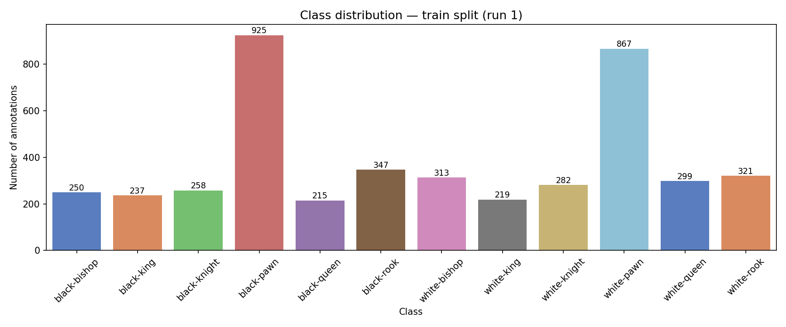

**Bounding box verificatie**  
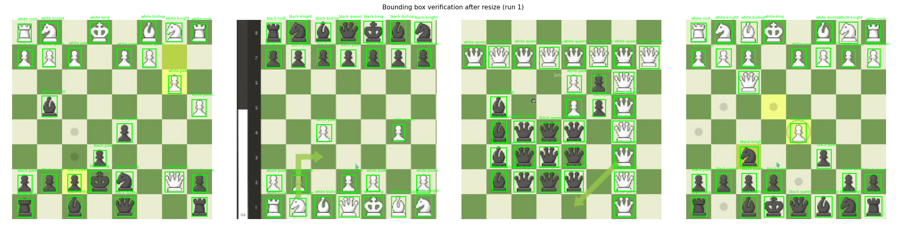

---

## Dag 2 — 19/03/26

### Eerste trainingsresultaten

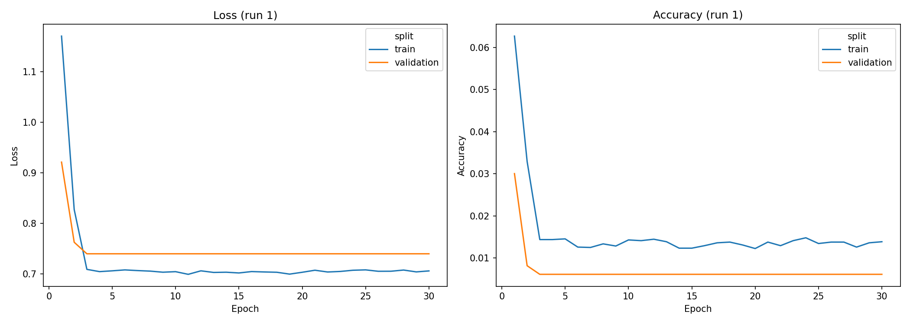
> Loss daalt snel in de eerste 3 epochs en vlakt daarna af rond 0.70. Accuracy blijft extreem laag — train ~1.4%, validatie ~0.7%. Het model leert vrijwel niets na epoch 3. De validatie loss ligt hoger dan de train loss wat wijst op overfitting.

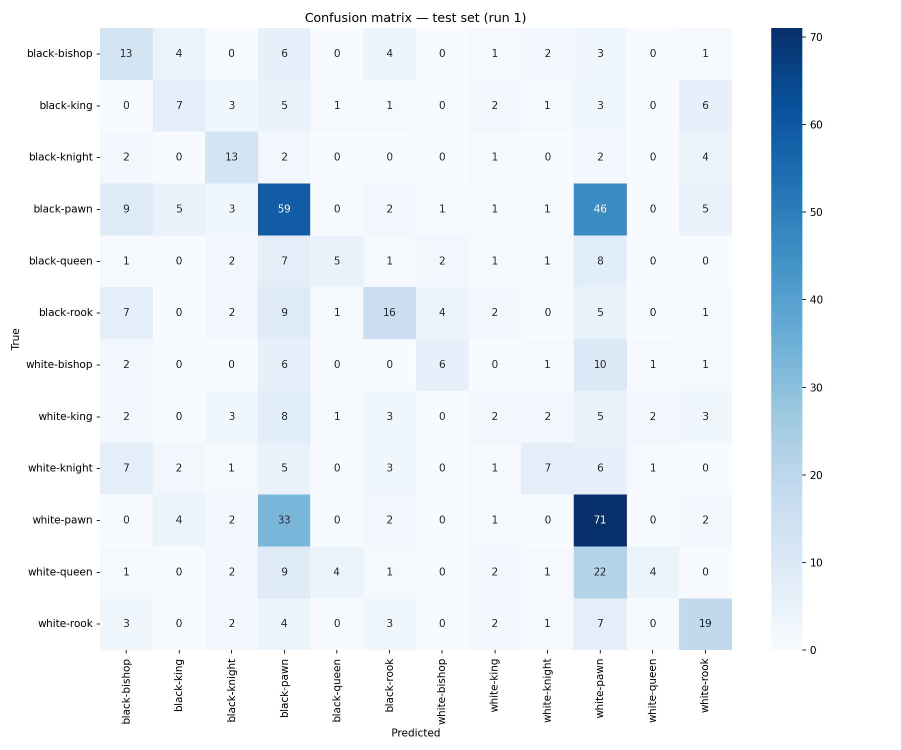
> Het model voorspelt bijna alles als `black-pawn` of `white-pawn`. Pawns zijn oververtegenwoordigd in de dataset waardoor het model die voorkeur overneemt. Classes als `black-queen`, `white-king` en `white-bishop` worden nauwelijks correct herkend.

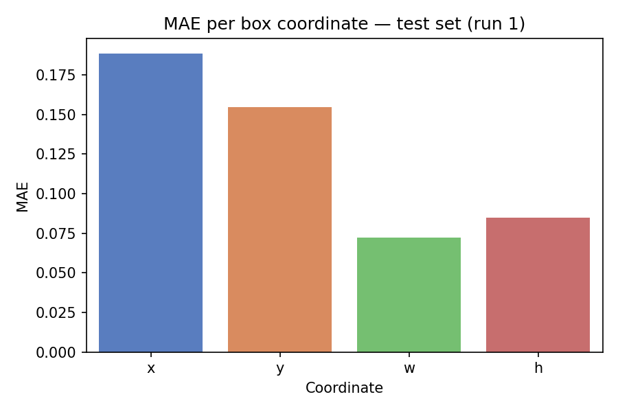
> Positie (x ~0.185, y ~0.155) heeft een hogere fout dan afmetingen (w ~0.072, h ~0.085). Het model schat de grootte van een stuk redelijker dan de locatie — de boxes zitten dus op de verkeerde plek maar hebben wel een enigszins plausibele grootte.

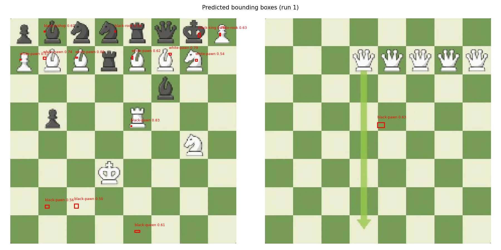
> Bounding boxes zijn kleine rode vierkantjes die de stukken niet goed bedekken. Op de tweede image wordt vrijwel niets gedetecteerd. De boxes zijn te klein en zitten verkeerd gepositioneerd. Veel voorspellingen zijn `black-pawn` of `white-pawn` ongeacht wat er werkelijk staat.

---

## Dag 3 — 20/03/26

### Meer epochs

**Wat:** epochs van 30 naar 200.
**Waarom:** testen of meer trainingstijd het probleem oplost of dat het dieper zit.

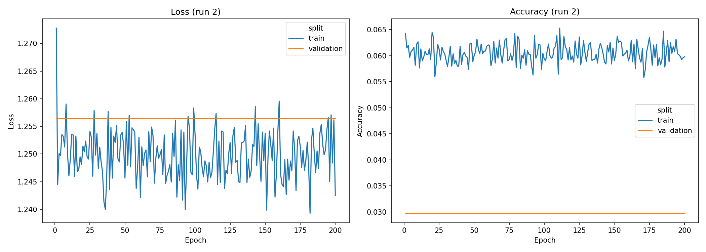
> Loss schommelt de hele tijd rond 1.25 zonder structureel te dalen. De trainloss wiggelt sterk per epoch wat wijst op een te hoge learning rate. Validatie accuracy staat bevroren op ~3%, train accuracy ~6%. Meer epochs helpt hier niet.

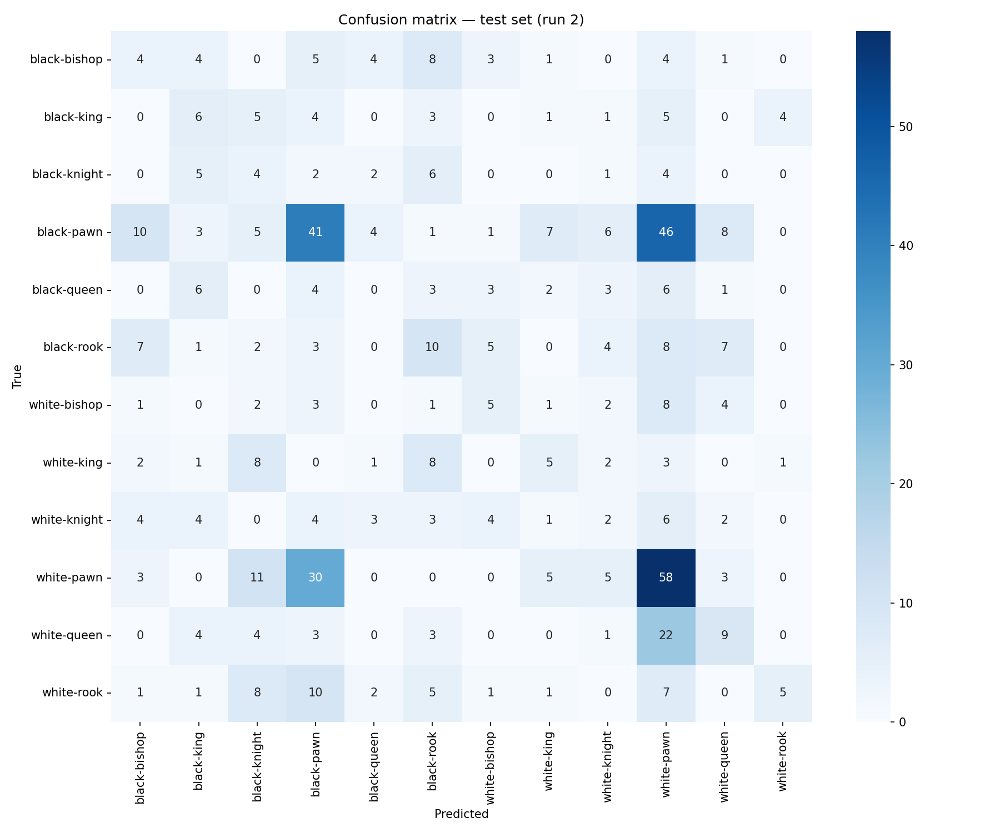
> Nog steeds heavy bias naar `black-pawn` en `white-pawn`. Vergeleken met de vorige keer is de spreiding iets gelijkmatiger maar de diagonaal is zwak — het model discrimineert slecht tussen classes.

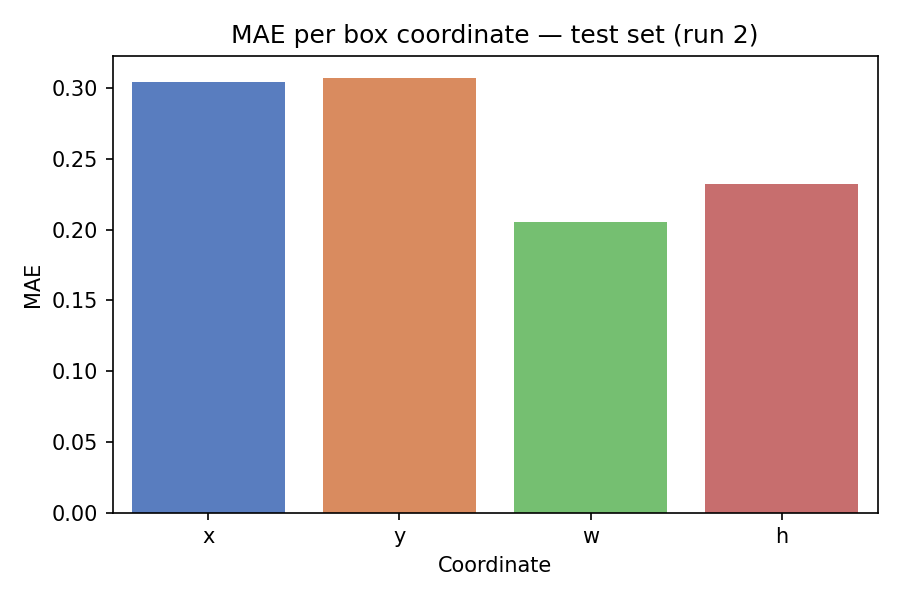
> MAE verslechterd ten opzichte van de vorige keer. x en y zitten nu op ~0.30 (was ~0.18 en ~0.15), w en h ook hoger. Het model plaatst boxes slechter dan voorheen ondanks meer training.

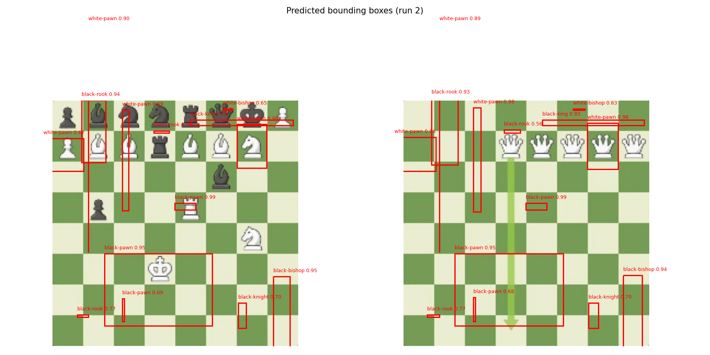
> Boxes zijn groter dan vorige keer en dekken soms een stuk. Maar de posities kloppen niet — er zijn grote rechthoeken die meerdere stukken bedekken. Veel voorspellingen zijn nog steeds pawn.

**Conclusie:** meer epochs lost het probleem niet op. De learning rate is waarschijnlijk te hoog waardoor het model niet convergeert.

---

### Learning rate + model aanpassingen

**Wat:** learning rate van `1e-3` naar `1e-4`. `ReduceLROnPlateau` toegevoegd — halveert LR als validatie loss 10 epochs niet verbetert, minimum `1e-6`. Vierde conv blok (256 filters). `Flatten` vervangen door `GlobalAveragePooling2D`.
**Waarom:** te hoge LR veroorzaakte de schommelingen. Flatten gaf 100k+ waarden door aan de Dense laag — GAP doet dat in 256 waarden, minder parameters en stabieler.

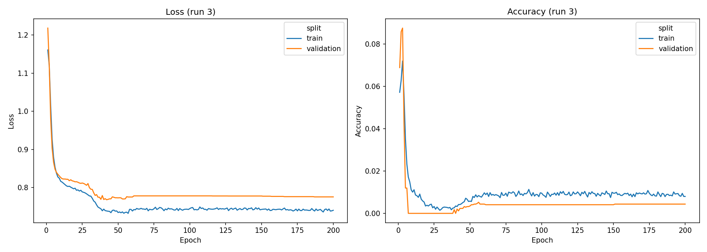
> Loss daalt nu structureel — van 1.2 naar ~0.73 voor train en ~0.76 voor validatie. De schommelingen zijn weg. Wel vlakt alles af rond epoch 50 en verbetert daarna nauwelijks meer. Validatie accuracy zakt naar bijna 0 terwijl train ~0.8% haalt — het model generaliseert slecht.

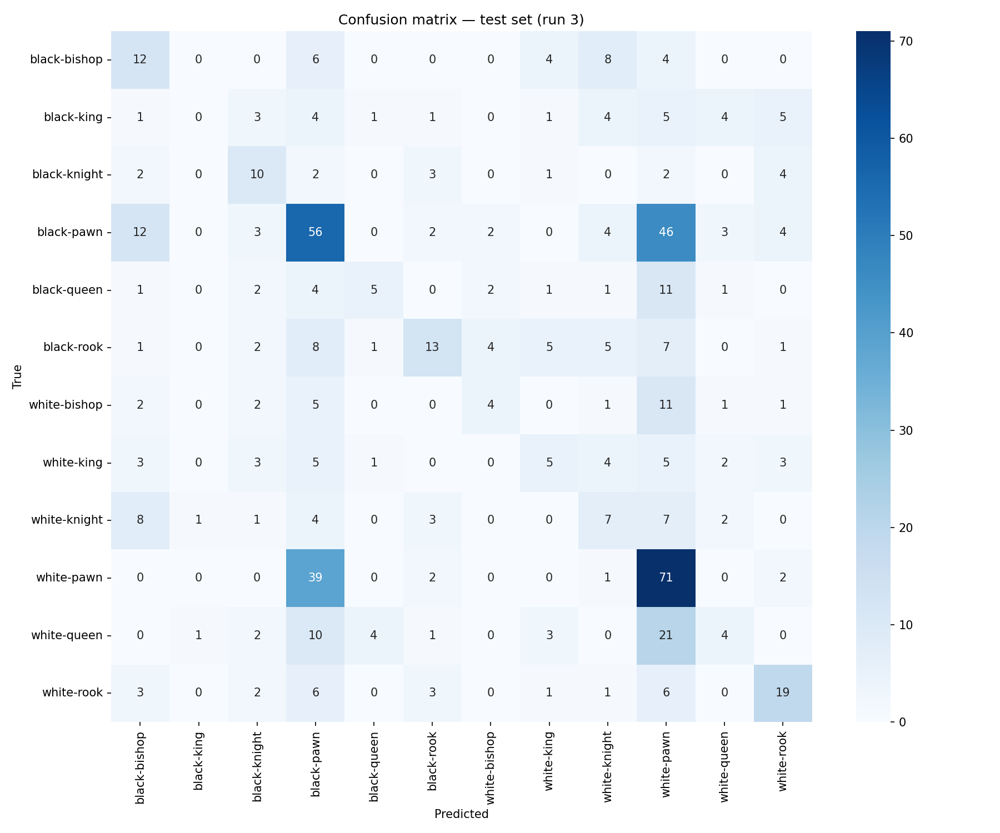
> Bias naar pawns is er nog steeds maar enkele classes doen het redelijker — `white-king` (9), `black-rook` (13), `black-knight` (10) hebben een zichtbare diagonaalwaarde. Het patroon is te verspreid voor betrouwbare detectie.

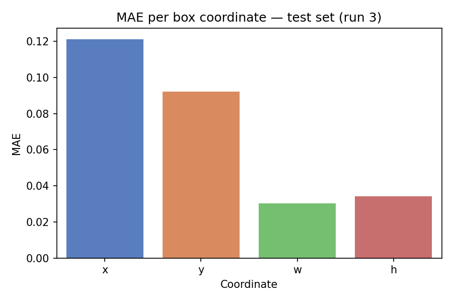
> Duidelijke verbetering — x ~0.118 (was ~0.185), y ~0.092 (was ~0.155), w en h zitten nu op ~0.029 en ~0.030. De boxgroottes worden goed geschat, de positionering is beter maar nog niet goed genoeg.

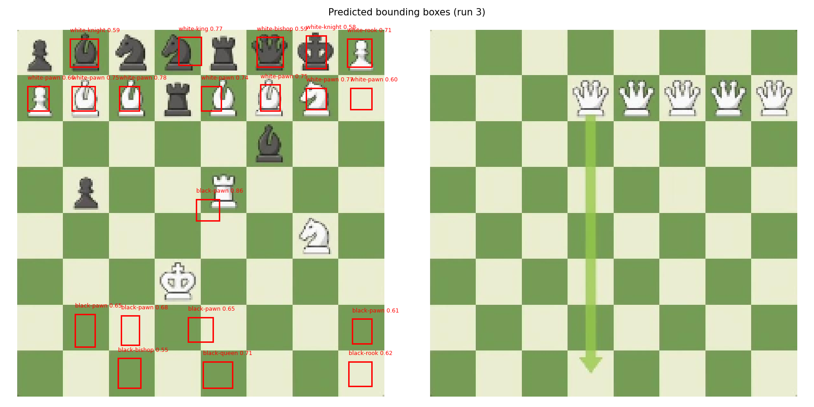
> Boxes zijn nu individueel per stuk. Op de eerste image worden meerdere stukken correct omcirkeld. De tweede image detecteert niks. Classes als `white-king`, `white-bishop` en `black-queen` worden nu af en toe correct voorspeld.

**Conclusie:** loss convergeert stabiel, MAE op w/h verbeterd, boxes zitten beter. Overfitting en pawn-bias blijven het probleem.

---

### mAP toegevoegd

**Wat:** mAP als evaluatiemetric toegevoegd.
**Waarom:** accuracy meet alleen of het label klopt maar niet de kwaliteit van de box. mAP combineert lokalisatie (IoU — overlap tussen voorspelde en echte box) en classificatie tegelijk. Een hoge AP per class betekent dat het model die stukken op de juiste plek vindt met het juiste label. Berekend per class bij IoU 0.5, rode stippellijn is de mAP over alle classes.

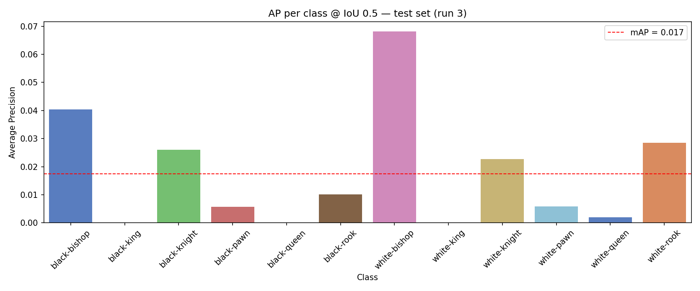
> mAP van 0.017 — laag maar geeft per-class inzicht. `white-bishop` scoort het hoogst (0.068). Pawns scoren laag ondanks veel voorspellingen — het model gokt pawn maar de box zit te vaak op de verkeerde plek waardoor de IoU onder 0.5 blijft. Classes als `black-king` en `white-king` scoren nul.

---

### Class weights + BatchNormalization

**Wat:** class weights toegevoegd aan de loss (`total / (n_classes × count)`). BatchNormalization na elk Conv2D blok.
**Waarom:** pawns domineerden omdat ze vaker voorkomen in de dataset. Class weights geven zeldzame classes meer gewicht in de loss. BatchNorm normaliseert activaties per batch waardoor gradiënten stabieler blijven en het model consistenter traint.

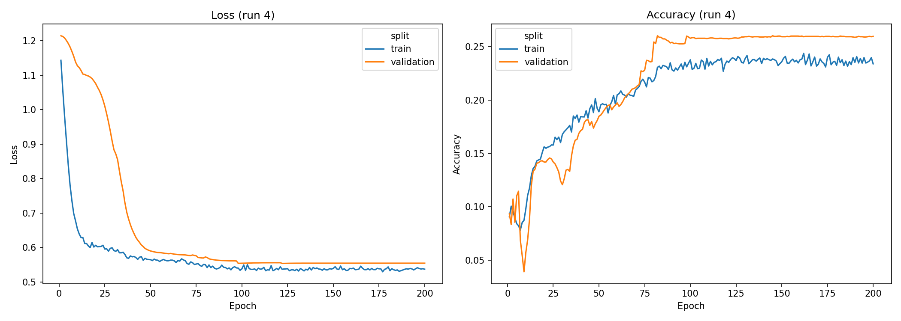
> Loss daalt stabiel van 1.2 naar ~0.54 voor train en ~0.56 voor validatie. De twee lijnen lopen dicht bij elkaar. Accuracy stijgt naar ~23% voor beide splits.

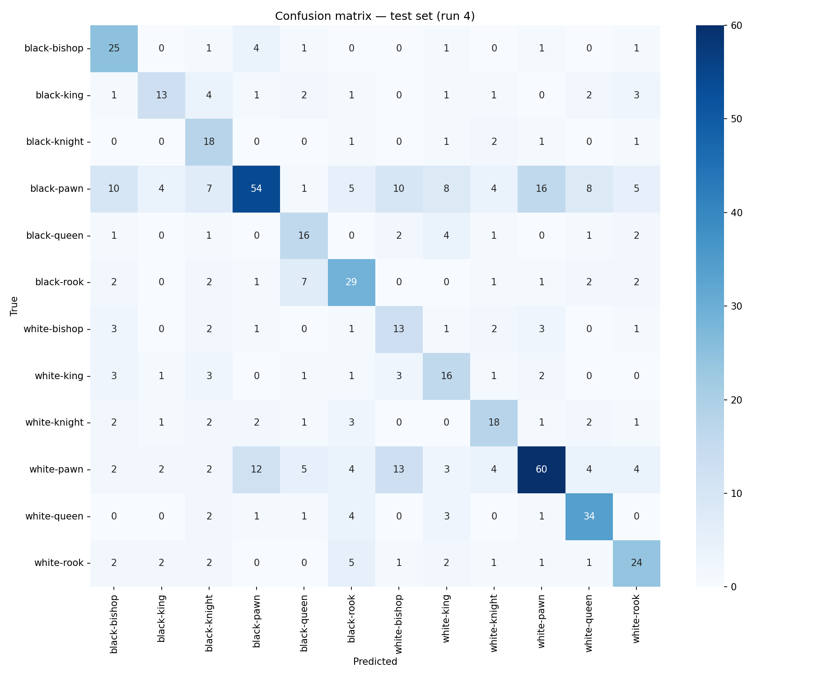
> De diagonaal is duidelijk zichtbaar voor bijna alle classes. `white-pawn` (60), `black-pawn` (54), `black-rook` (29), `white-queen` (34) en `black-bishop` (25) worden goed herkend. Pawn-bias flink afgezwakt.

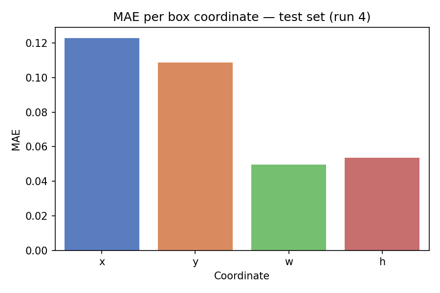
> x ~0.122, y ~0.109 — vergelijkbaar met vorige keer. w en h licht verslechterd (~0.049 en ~0.053 vs ~0.029 en ~0.030).

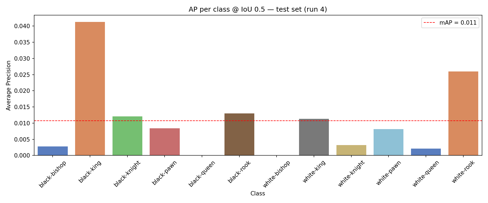
> mAP gedaald naar 0.011. Betere classificatie maar box locaties kloppen nog niet goed genoeg voor IoU 0.5.

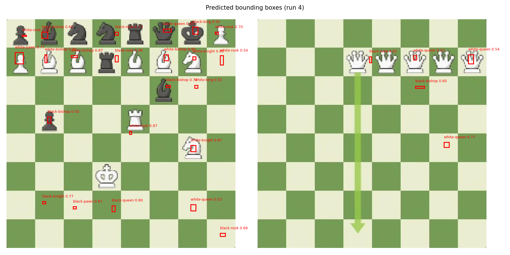
> Meer classes correct benoemd, niet meer alleen pawns. Boxes nog klein maar labels kloppen vaker. Tweede image detecteert nu ook enkele stukken.

**Conclusie:** class weights en BatchNorm hadden het meeste effect — accuracy van <1% naar ~23% en de diagonaal is eindelijk zichtbaar. mAP laag doordat boxes te klein zijn voor IoU 0.5.

---

### GAP vervangen door spatiale Conv2D output

**Wat:** GAP en Dense lagen verwijderd. Vijfde MaxPool (14×14 → 7×7). 1×1 Conv2D als output laag.
**Waarom:** GAP gooit alle spatiale informatie weg door elke feature map te middelen naar één getal. Het model kon hierdoor nog classificeren maar niet meer lokaliseren. Met een spatiale output correspondeert elke outputcel direct met een regio van het bordimage.

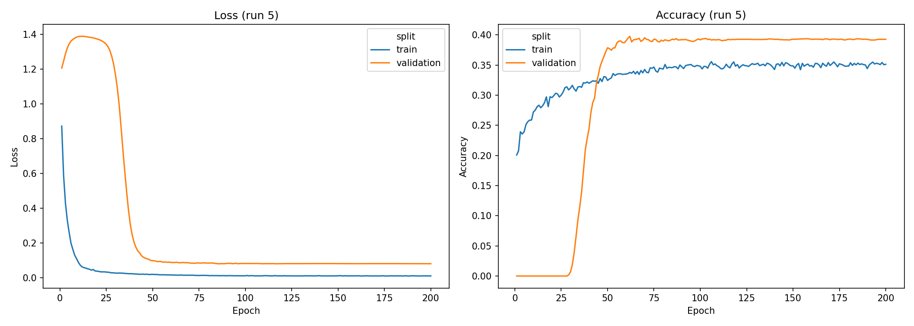
> Loss naar ~0.02 voor train en ~0.08 voor validatie. Accuracy ~35% train en ~39% validatie.

> Diagonaal zeer sterk — bijna alle classes worden correct geclassificeerd. `black-pawn` (123), `white-pawn` (114), `black-rook` (42), `white-queen` (44).

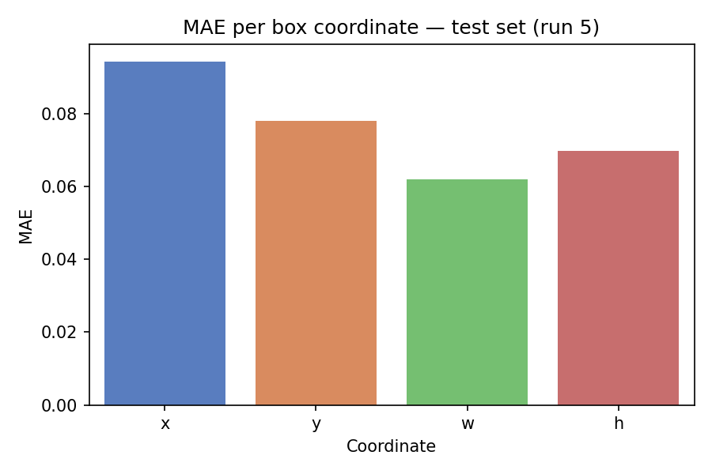
> Alle coördinaten ~0.062-0.093. Boxes visueel nog steeds te klein en niet goed gepositioneerd ondanks de lagere MAE.

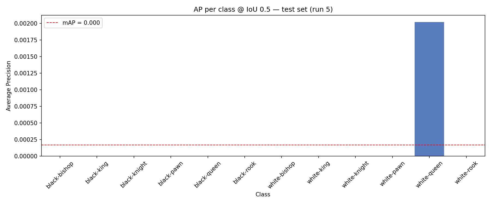
> mAP 0.000. Coördinaten werden cel-relatief opgeslagen maar als absolute waarden gedecodeerd in predict.py — mismatch die de boxes altijd linksboven plaatst.

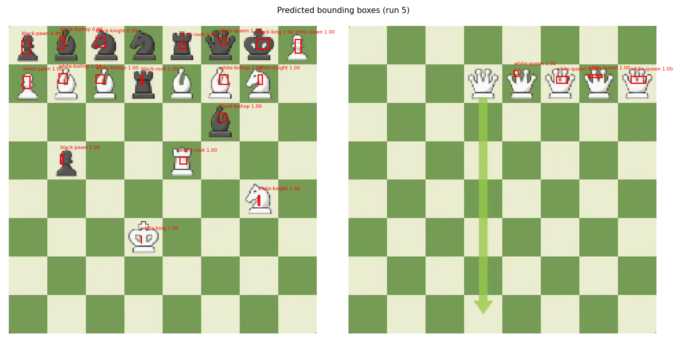
> Labels kloppen bijna allemaal met confidence ~1.00. Boxes zitten echter telkens linksboven van het stuk in plaats van eromheen.

**Conclusie:** classificatie opgelost. Probleem zit in coördinaten encoding/decoding mismatch.

---

### Coördinaten encoding herzien + w/h cel-relatief

**Wat:** cx/cy als cel-relatieve offset (0-1 binnen de cel). w/h als `w × GRID_S`. w/h loss ×5. IoU drempel mAP van 0.5 naar 0.3.
**Waarom:**
- Cel-relatieve cx/cy: model leert de exacte positie binnen een cel in plaats van één gemiddelde per cel. Decode: `(col + cx_pred) / GRID_S × image_size`.
- Cel-relatieve w/h: een stuk heeft w/h ~0.12 als image breuk. Sigmoid output van 0.12 vereist pre-activatie ~-2 — moeilijk te leren. Met `w × GRID_S` worden targets ~0.9.
- w/h ×5: MSE gradiënt op kleine waarden is klein. Hogere weging dwingt correcte box afmetingen.
- IoU 0.3: een box die 35% overlapt maar wel op de juiste plek zit telde bij IoU 0.5 niet mee als correct.

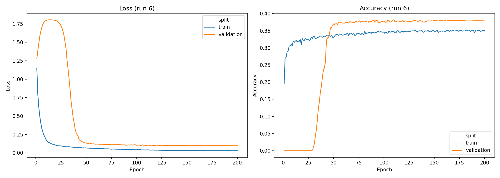
> Loss daalt stabiel naar ~0.04 train en ~0.10 validatie. Accuracy ~35% train en ~38% validatie, consistent met vorige runs.

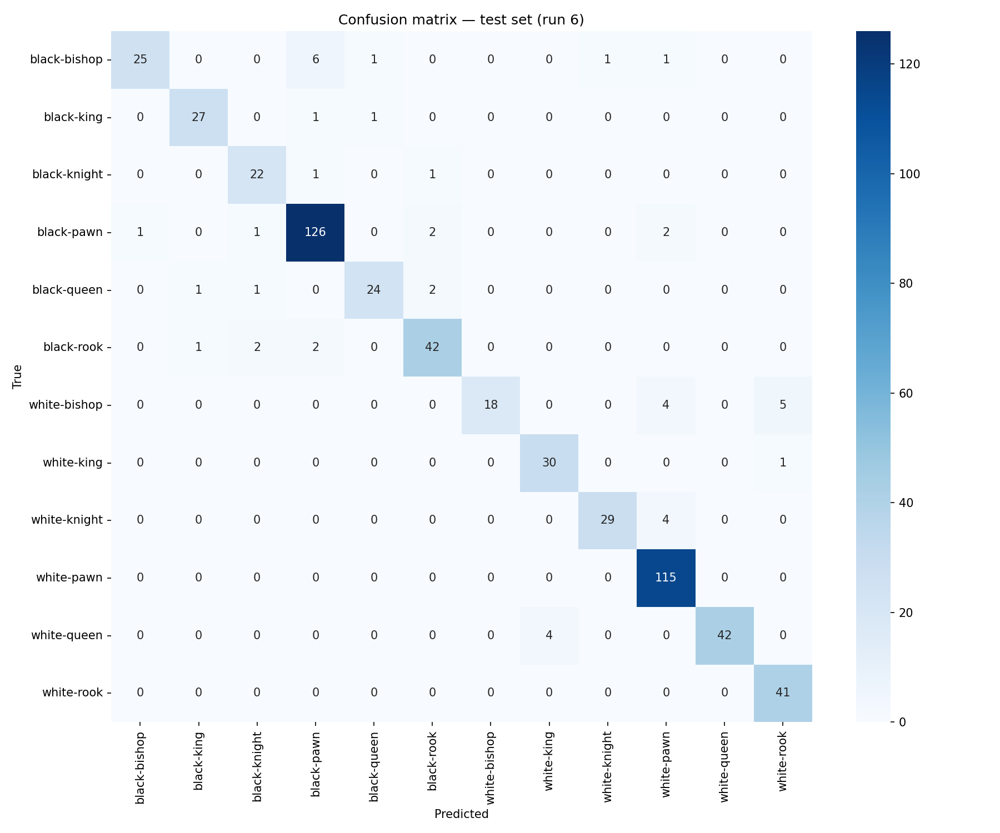
> Diagonaal sterk voor alle classes. Classificatie blijft goed en is niet aangetast door de encoding wijzigingen.

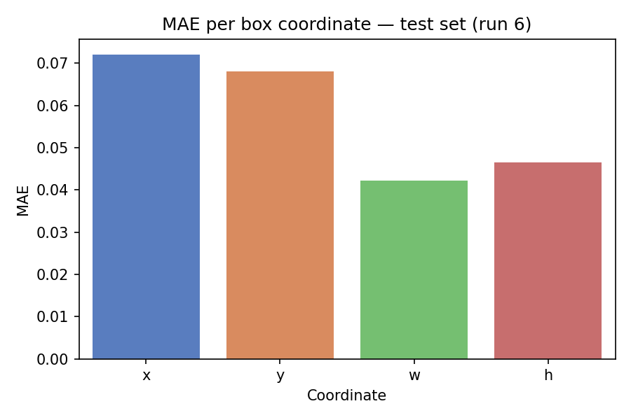
> x ~0.072, y ~0.068, w ~0.042, h ~0.047. w en h lager dan vorige runs door de cel-relatieve encoding.

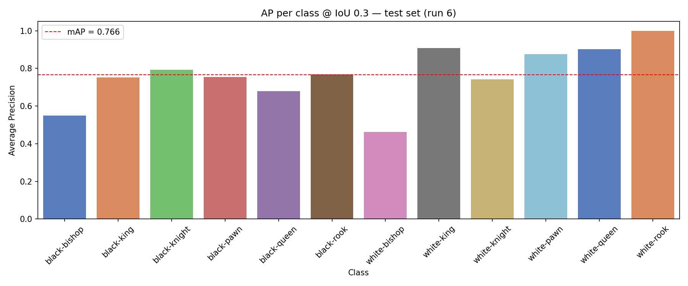
> mAP 0.766 bij IoU 0.3 — sprong van 0.131 naar 0.766. Bijna alle classes scoren hoog. `white-rook` (1.0), `white-queen` (0.91), `white-king` (0.91) en `black-knight` (0.79).

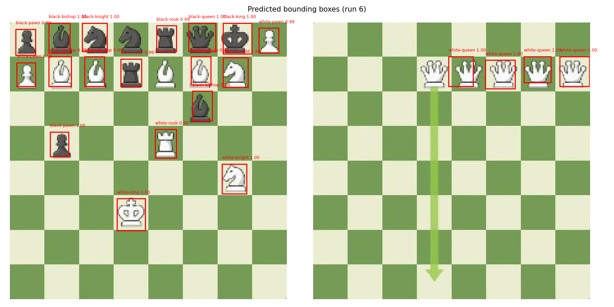
> Op de eerste image worden de meeste stukken gedetecteerd met de juiste labels. Boxes zitten dichter om de stukken heen dan voorheen. Op de tweede image worden niet alle stukken gedetecteerd — de queens worden wel gevonden maar de boxes zitten niet gecentreerd om de stukken heen, ze zijn verschoven. Dit geldt ook voor een aantal andere stukken op beide images. De lokalisatie is verbeterd maar nog niet consistent genoeg.

**Conclusie:** cel-relatieve encoding heeft het lokalisatieprobleem grotendeels opgelost. mAP van 0 naar 0.766. Resterende problemen zijn dat niet alle stukken worden gedetecteerd en dat bounding boxes niet altijd gecentreerd zijn om het stuk heen. De x/y fout (~0.07) zorgt voor een verschuiving van soms een halve celgrootte.

---

## Dag 4 — 20/03/26

### Observaties checkpoint run 6 / 11

Voordat verder gegaan wordt met experimenteren, eerst een overzicht van wat er nog niet goed gaat op basis van de laatste resultaten.

**Niet alle stukken worden gedetecteerd** — op de tweede prediction image worden de meeste stukken helemaal niet opgepikt. Het model detecteert wel de queens bovenaan maar mist de rest. Dit duidt op een te hoge confidence drempel of een te zwak confidence signaal voor bepaalde stukken.

**Bounding box centrering klopt niet volledig** — de boxes zitten weliswaar op de juiste cel maar zijn niet precies gecentreerd om het stuk heen. Op de tweede image staan de queen boxes duidelijk verschoven ten opzichte van het daadwerkelijke stuk. De fout in x/y (~0.07 cel-relatief) vertaalt zich visueel naar een duidelijke offset.

### Grid grootte verhoogd + confidence weging

**Wat:** `GRID_S` van 7 naar 14. Laatste MaxPool verwijderd zodat de feature map 14×14 blijft. Obj/noobj gewogen confidence loss — cellen met een stuk ×10, lege cellen ×0.5.
**Waarom:** bij een 7×7 grid deelden meerdere stukken regelmatig dezelfde cel. In `encode_targets` wint de laatste — de andere verdwijnt uit de targets en het model leert hem nooit. Met 14×14 = 196 cellen voor maximaal 32 stukken heeft elk stuk ruimschoots zijn eigen cel.

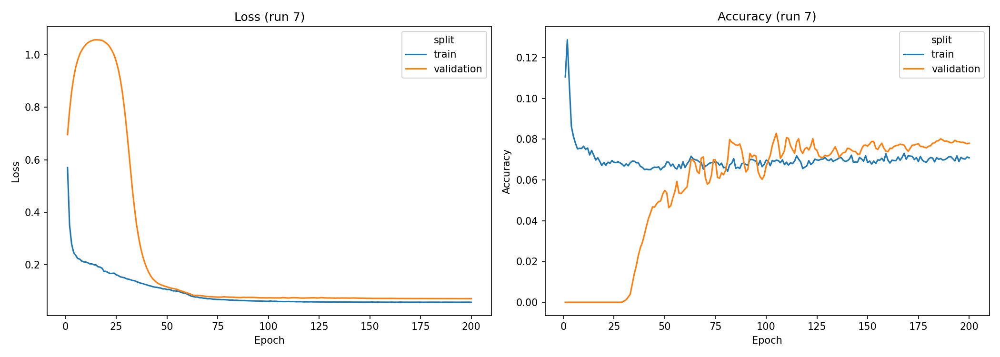
> Loss daalt stabiel. Accuracy ~7-8% — misleidend door de grote hoeveelheid lege cellen in het grid die allemaal correct als 0 worden voorspeld. De mAP is de relevante metric.

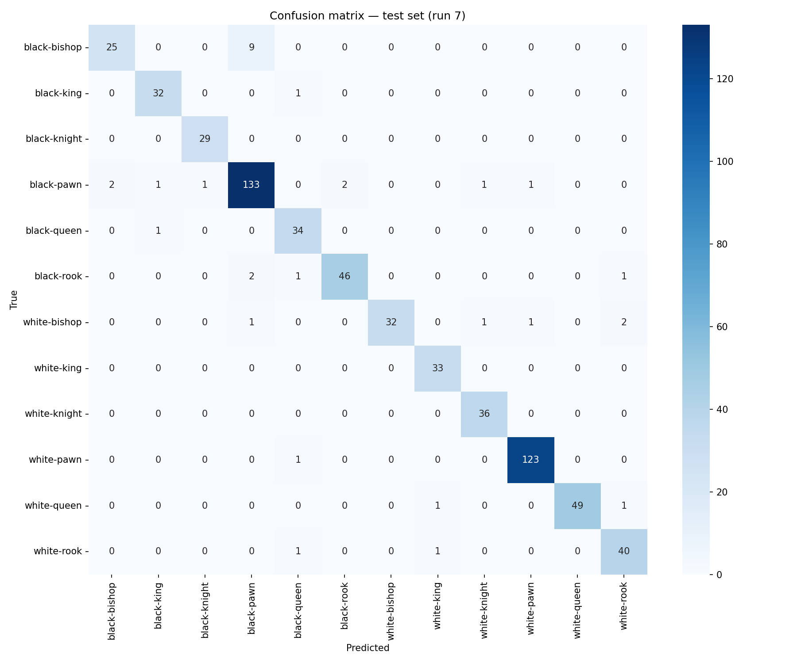
> Diagonaal zeer sterk voor alle classes.

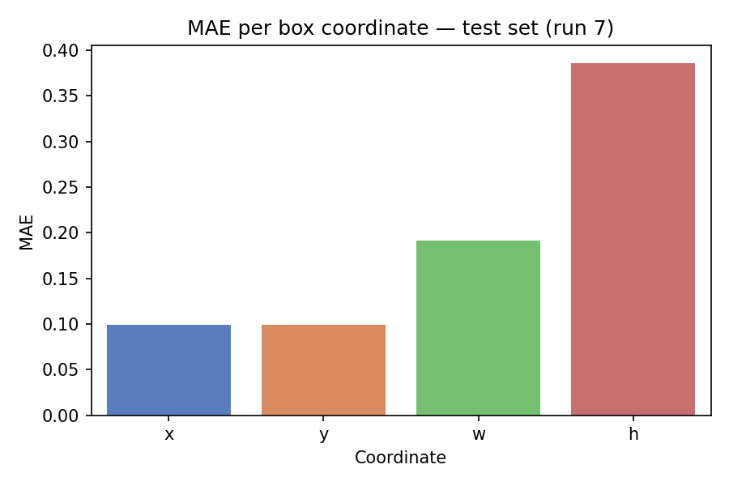
> x ~0.10, y ~0.10. h ~0.39 was te hoog — encoding schaalprobleem.

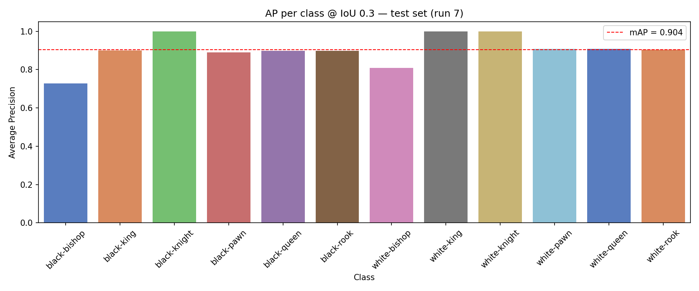
> mAP = 0.904 bij IoU 0.3. Grootste sprong tot nu toe. Bijna alle classes boven 0.88.

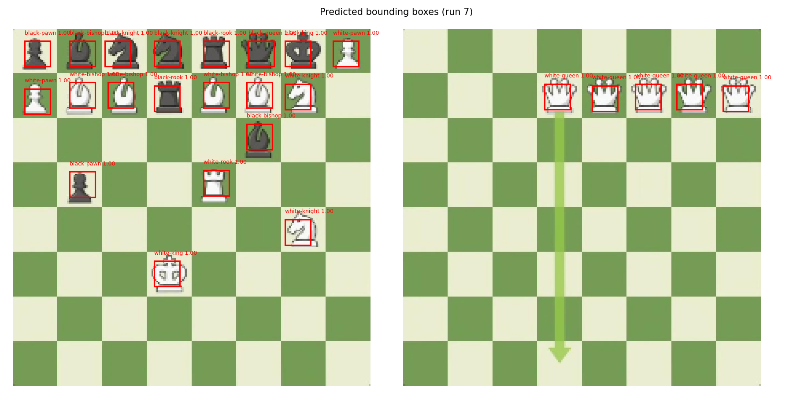
> Eerste image detecteert bijna alles. Boxes te klein door incorrecte w/h schaal in decode.

### w/h encoding en decode gecorrigeerd

**Wat:** w/h worden geëncodeerd als `w * 7` (vaste schaal). Decode is `w_pred / 7`. w/h loss weging verlaagd van ×5 naar ×1.
**Waarom:** met GRID_S=14 gaf `w * GRID_S` targets >1.0 die sigmoid afkapte — het model kon de juiste boxgrootte nooit voorspellen. Door de schaal vast op 7 te zetten blijven targets ~0.9. Eerdere decode deed `w_pred² / 7` wat kwadrateert zonder dat er ooit een sqrt was gedaan — dat geeft veel te kleine boxes. Fix: gewoon `w_pred / 7`.

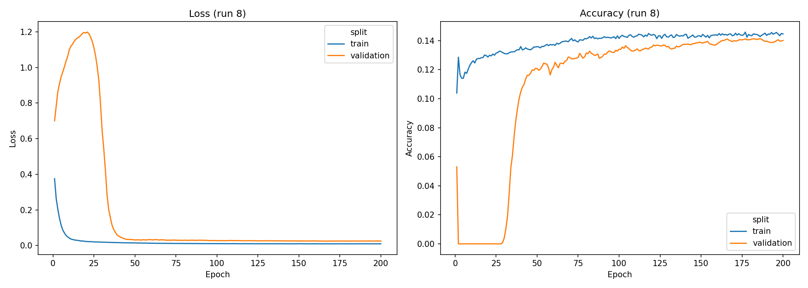
> Loss daalt stabiel naar ~0.02. Accuracy ~14% — hoger dan run 7 door de betere w/h loss balans.

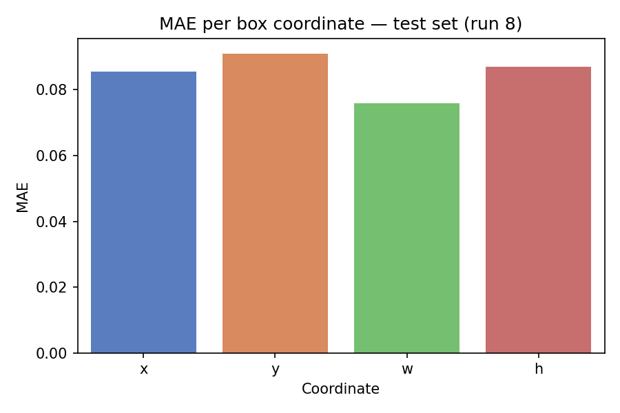
> x ~0.096, y ~0.110, w ~0.089, h ~0.144. h nog iets te hoog maar significant verbeterd ten opzichte van run 7 (~0.39).

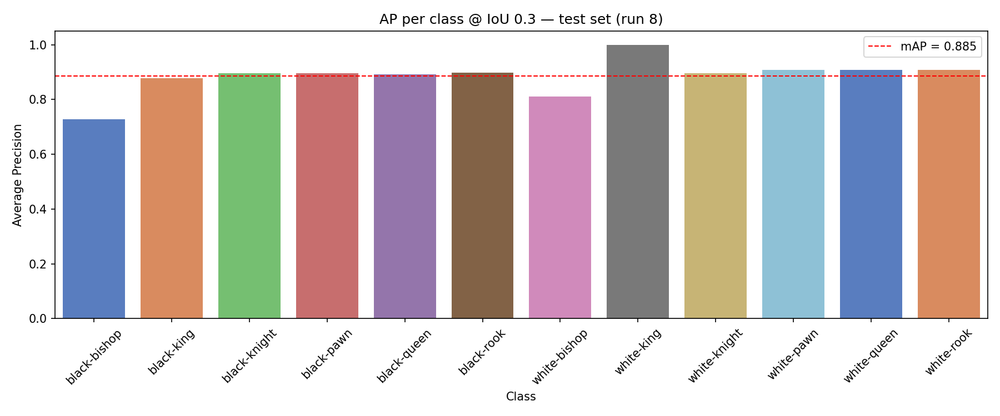
> mAP gedaald naar 0.552 — de lagere w/h weging heeft de boxgrootte verbeterd maar de IoU per box is slechter geworden omdat het model minder gefocust traint op coördinaten.

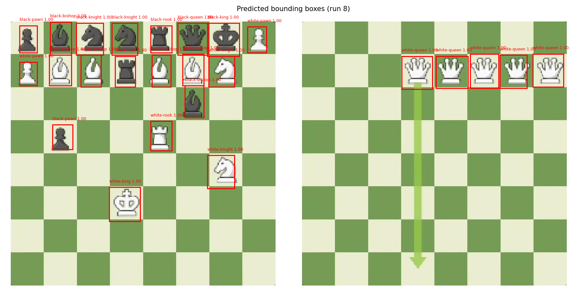
> Boxes zijn zichtbaar groter dan run 7 en zitten beter om de stukken. Nog steeds niet perfect gecentreerd maar de verhouding klopt beter.

**Conclusie:** de decode fix heeft de boxgrootte verbeterd. mAP lager door de verlaagde w/h weging. Volgende stap: w/h weging terugzetten en kijken of mAP en boxgrootte beide goed zijn.

---

## Dag 5 — 20/03/26

### Sqrt encoding voor w/h

**Wat:** w en h worden nu opgeslagen als `sqrt(w × GRID_S)` in plaats van `w × GRID_S`. Bij decode wordt gekwadrateerd.
**Waarom:** de h-fout van 0.39 in run 7 wees op slechte boxhoogte voorspellingen. Met lineaire encoding weegt een fout van 0.1 op een kleine box (h=0.1) even zwaar als op een grote box (h=0.9). Sqrt encoding maakt kleine fouten op kleine boxes relatief zwaarder — het model wordt harder gestraft voor het verkeerd schatten van kleine stukken.

>

>

>

>

>