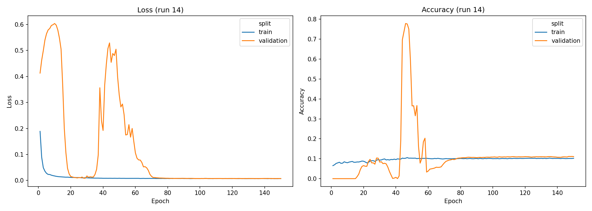
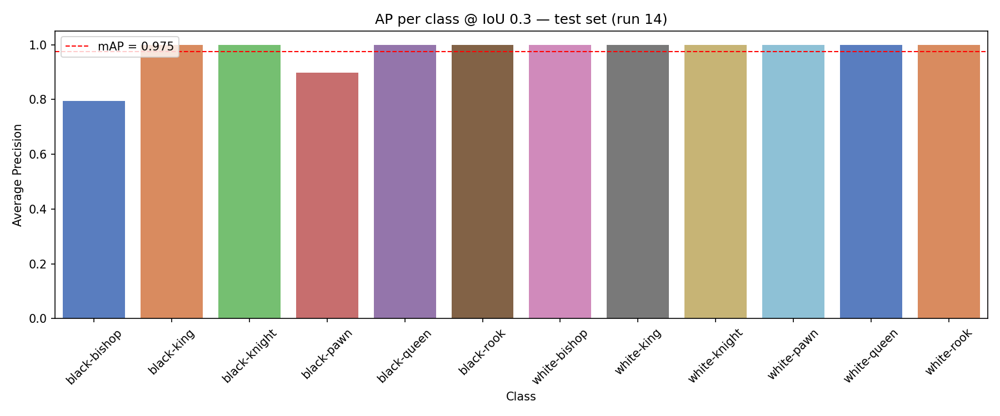
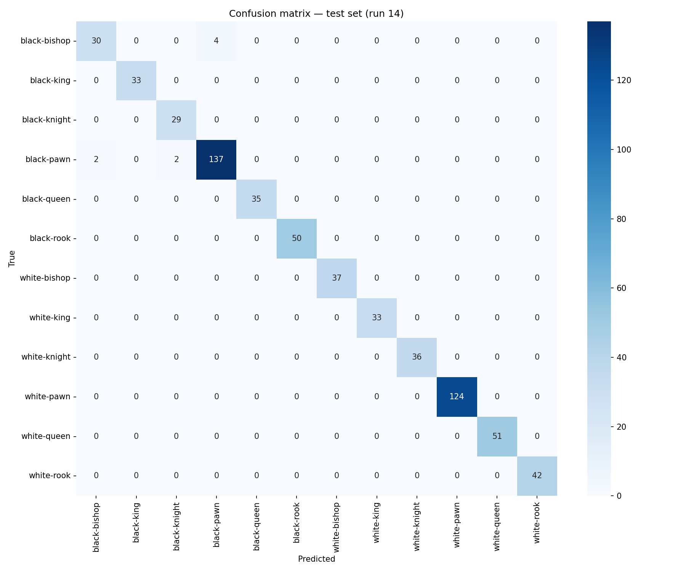
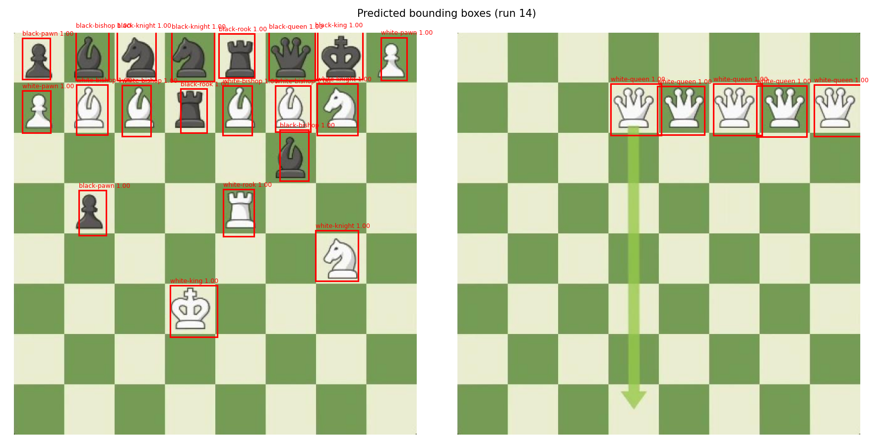
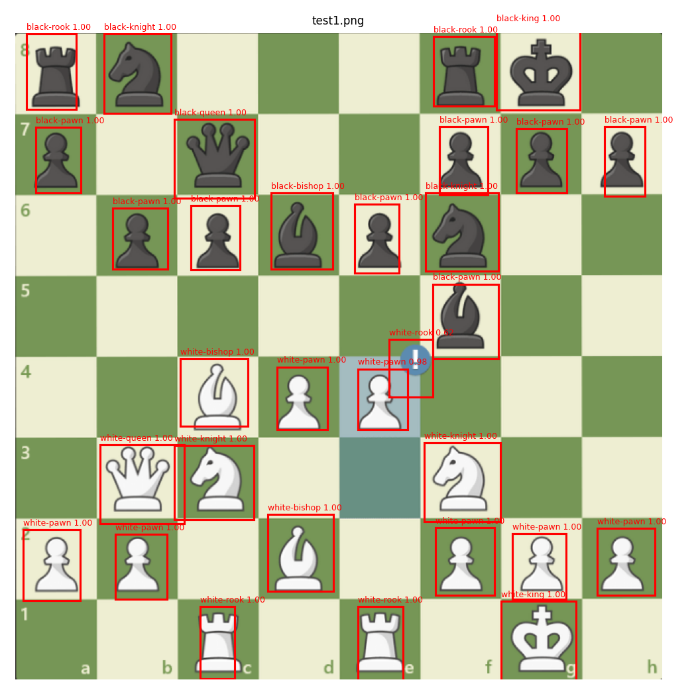
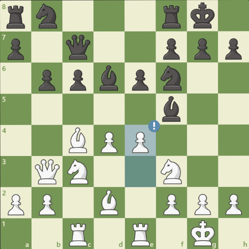
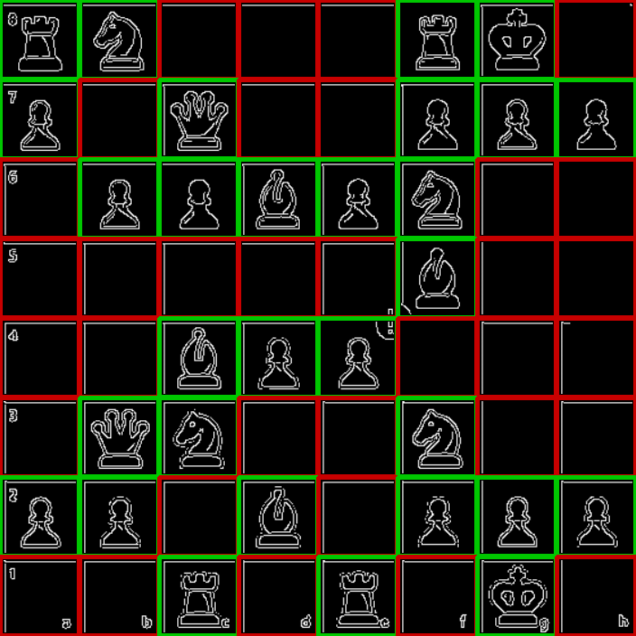
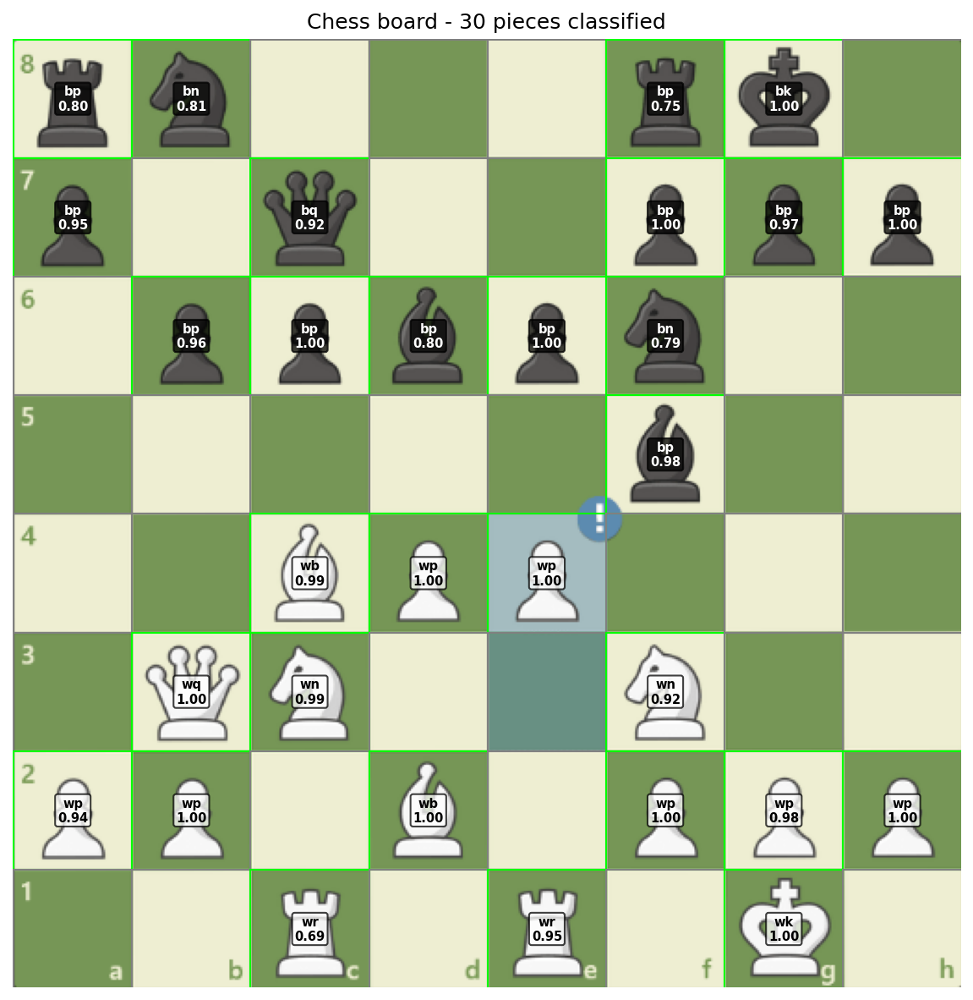

# Schaakstukken herkennen met een neuraal netwerk

**Vak:** Computer Vision
**Datum:** maart 2026

---

## Wat is het doel?

Het doel van dit project is om schaakstukken automatisch te herkennen op een willekeurige foto of schermopname van een schaakbord. Het systeem moet de volledige bordpositie kunnen uitlezen: welk stuk staat op welke cel.

Er zijn 12 klassen die herkend moeten worden:

| Zwart | Wit |
|---|---|
| black-pawn | white-pawn |
| black-rook | white-rook |
| black-knight | white-knight |
| black-bishop | white-bishop |
| black-queen | white-queen |
| black-king | white-king |

---

## De dataset

Er worden twee datasets gecombineerd, beide afkomstig van Roboflow. Elke afbeelding heeft een CSV-bestand met de klasse en de coordinaten van elk stuk als bounding box. Beide datasets zijn gelicenseerd onder CC BY 4.0.

| Dataset | Afbeeldingen | Link |
|---|---|---|
| Chess.com (set 1) | 167 | https://universe.roboflow.com/ml-ki9ku/chess.com |
| Chess.com Pieces (set 2) | 183 | https://universe.roboflow.com/chess-pieces-8qwqx/chess.com-pieces |

Beide sets zijn voor export al geresized naar 640x640 pixels via Roboflow. De annotaties zijn in Tensorflow Object Detection formaat: een CSV-bestand per split met kolommen voor bestandsnaam, klasse en de vier hoekcoordinaten van elke bounding box (xmin, ymin, xmax, ymax).

Door de twee sets samen te voegen ontstaat een gecombineerde dataset van circa 350 afbeeldingen voor training, validatie en test. Elke afbeelding bevat een volledig schaakbord met meerdere stukken tegelijk.

Een structureel probleem in de data is klasse-imbalans. Op een schaakbord staan standaard 16 pawns maar slechts 2 kings, 2 bishops, 2 knights en 2 rooks per kleur. Dit verschil zit direct in de trainingsdata. Het model wordt tijdens training veel vaker gecorrigeerd op pawn-fouten dan op bishop-fouten, waardoor het bij twijfel automatisch richting pawn trekt. Dit probleem speelt in beide fases van het project een rol.

---

## Fase 1: grid-gebaseerde detectie (runs 1-14)

### Hoe werkt het?

De eerste aanpak is gebaseerd op hetzelfde principe als YOLO: de volledige bordafbeelding wordt in een keer door het netwerk gestuurd. Het netwerk verdeelt het beeld intern in een raster van 20x20 cellen en voorspelt per cel of er een stuk staat, waar het middelpunt zich bevindt, hoe groot de bounding box is, en welk type stuk het is.

Dit is fundamenteel anders dan een aanpak waarbij elk stuk eerst apart wordt uitgeknipten en dan geclassificeerd. In de grid-aanpak is er geen aparte detectiestap nodig: het netwerk doet alles in een enkele voorwaartse pass.

De outputtensor heeft de vorm `(20, 20, 17)`. Per cel zijn dat 17 waarden:

- x en y: de offset van het stuk-middelpunt binnen de cel, uitgedrukt als waarde van 0 tot 1
- w en h: de breedte en hoogte van de bounding box als fractie van het totale beeld
- confidence: de zekerheid van het model dat er een stuk in deze specifieke cel aanwezig is
- 12 klassewaarden in one-hot formaat: precies een waarde is 1, de rest is 0

Bij een 20x20 grid zijn er in totaal 400 cellen. Op een schaakbord staan maximaal 32 stukken, dus de meeste cellen zijn altijd leeg. Het model moet leren om lege cellen ook als leeg te voorspellen en tegelijk de gevulde cellen correct te lokaliseren en te classificeren.

---

### Het model (grid-detector)

```
Input: 640x640x3

Block 1  640x640  -> Conv2D 32  + BatchNorm + LeakyReLU -> MaxPool -> 320x320
Block 2  320x320  -> Conv2D 64  + BatchNorm + LeakyReLU -> MaxPool -> 160x160
Block 3  160x160  -> Conv2D 128 + Residual               -> MaxPool -> 80x80
Block 4   80x80   -> Conv2D 256 + Residual               -> MaxPool -> 40x40
Block 5   40x40   -> Conv2D 512 + BatchNorm + LeakyReLU  -> MaxPool -> 20x20

Detection head:
           20x20  -> Conv2D 256 (1x1) + Dropout 0.3
           20x20  -> Conv2D 17  (1x1) + sigmoid
Output:    20x20x17
```

Het netwerk bestaat uit vijf opeenvolgende blokken. Elk blok leert patronen op een bepaald abstractieniveau: het eerste blok herkent basale randen en kleurgrenzen, latere blokken combineren die tot steeds complexere vormen zoals de puntige top van een pawn of de ronde bovenkant van een rook. Na elk blok halveert een MaxPooling laag de breedte en hoogte van de feature map, waardoor het netwerk steeds compacter maar informatierieker wordt.

Na het laatste MaxPooling blok is de feature map precies 20x20 pixels groot, wat overeenkomt met de gewenste gridgrootte. De detectiehead zet deze 20x20 feature map direct om naar de outputtensor via twee 1x1 Conv lagen zonder Flatten of Dense lagen. Dit is cruciaal: door de ruimtelijke structuur te bewaren weet elke uitvoercel exact welke regio van het inputbeeld hij beschrijft.

**Residual blokken** in blocks 3 en 4 voegen de oorspronkelijke input op bij de output via een skip-connection. Het effect is dat het netwerk leert wat het moet toevoegen aan wat het al weet, in plaats van alles opnieuw te moeten leren. Dit maakt diepere netwerken mogelijk zonder dat het gradient-signaal wegsterft tijdens training.

**BatchNorm** na elke Conv laag normaliseert de activaties per minibatch zodat ze gemiddeld rond nul liggen. Zonder dit kunnen activaties in diepere lagen erg groot of erg klein worden, wat het leerproces destabiliseert.

**LeakyReLU** geeft bij negatieve inputwaarden een kleine waarde terug (0.1 x input) in plaats van nul zoals bij standaard ReLU. Dit voorkomt het dead neuron probleem, waarbij neuronen die consequent negatieve input krijgen helemaal ophouden met bijdragen aan het leerproces.

---

### Verliesfunctie

Een standaard verliesfunctie zoals crossentropy is niet geschikt voor objectdetectie omdat die alleen het klasselabel beoordeelt en niets zegt over of de bounding box op de juiste plek zit. Er is een custom verliesfunctie gebouwd die drie onderdelen combineert:

| Term | Berekend op | Weging |
|---|---|---|
| Box loss (MSE op x, y, w, h) | Alleen gevulde cellen | w en h krijgen extra gewicht x5 |
| Confidence loss | Gevulde cellen x10, lege cellen x0.5 | Asymmetrisch |
| Class loss (MSE op klassewaarden) | Alleen gevulde cellen | Per class weight op basis van frequentie |

De box loss berekent het gemiddeld kwadraat van het verschil tussen de voorspelde en werkelijke coordinaten. Alleen cellen die een stuk bevatten tellen mee: een fout op een lege cel heeft geen betekenis voor de lokalisatietaak.

De confidence loss is asymmetrisch opgezet. Bij een 20x20 raster zijn de meeste cellen leeg. Als lege en gevulde cellen even zwaar wegen, domineert het signaal "er staat niets" de gehele training en leert het model nooit om stukken te detecteren. Door gevulde cellen 20 keer zo zwaar te laten wegen als lege cellen (10 tegenover 0.5) wordt het model veel harder bijgestuurd op gevallen waar het een stuk mist of verkeerd plaatst.

Class weights corrigeren voor de klasse-imbalans in de data: zeldzamere klassen zoals de king krijgen een hoger gewicht zodat een fout op een king even hard meetelt als meerdere fouten op pawns.

---

### Evaluatie

De hoofdmetric is mAP (mean Average Precision) bij een IoU-drempel van 0.3. Een detectie telt alleen als correct als aan twee voorwaarden tegelijk is voldaan: het voorspelde klasselabel moet kloppen en de bounding box moet voldoende overlappen met de werkelijke box.

IoU (Intersection over Union) is de verhouding tussen de oppervlakte van de overlapping van twee boxes en de oppervlakte van hun samenvoeging. Een IoU van 1.0 betekent perfecte overlap, een IoU van 0.0 betekent geen overlap. Bij een drempel van 0.3 moet de voorspelde box minstens 30% gemeenschappelijke oppervlakte hebben met de ground truth box.

Per klasse wordt de Average Precision berekend: het gemiddelde van de precisie over alle recall-niveaus. De mAP is het gemiddelde van de AP over alle 12 klassen. Een mAP van 1.0 betekent dat alle stukken worden gevonden, correct gelabeld en correct gelokaliseerd.

---

### Trainingscurve (run 14)

De trainingscurve laat zien hoe de fout (loss) zich ontwikkelt over de trainingsepochs. Een epoch is een volledige pass over de hele trainingsset. Na elke epoch wordt de validatieloss berekend op de afbeeldingen die het model niet heeft gezien tijdens training.



De loss daalt stabiel voor zowel train als validatie en de twee lijnen liggen dicht bij elkaar. Dit is een goed teken: het model generaliseert en memoriseert de trainingsdata niet. De piek in de validatieloss rond epoch 40 is een tijdelijke instabiliteit, waarschijnlijk veroorzaakt door een automatische verlaging van de learning rate. Het model herstelt daarna en blijft dalen. De accuracy-grafiek is bij dit type model geen betrouwbare metric: de meeste gridcellen zijn leeg en worden correct als leeg voorspeld, wat de accuracy kunstmatig hoog maakt zonder dat er stukken worden herkend.

---

### mAP per klasse (run 14)

De mAP-grafiek toont per klasse hoe goed het model scoort op de combinatie van localisatie en classificatie.



De gestippelde rode lijn is de gemiddelde mAP van 0.975. Bijna alle klassen scoren boven 0.95, wat betekent dat het model de stukken zowel op de juiste positie plaatst als correct labelt. black-bishop is de laagste klasse met een score van circa 0.83. Dit is het eindresultaat na 14 runs van iteratieve verbeteringen aan architectuur, verliesfunctie en coordinatenencoding.

---

### Confusion matrix (run 14)

De confusion matrix toont voor elke combinatie van het werkelijke label (rijen) en het voorspelde label (kolommen) hoeveel testpatches in die cel vallen. De diagonaal zijn de correcte voorspellingen.



De diagonaal is donker en de rest van de matrix is licht, wat aangeeft dat het model bijna altijd het juiste label kiest. black-bishop heeft 4 foute voorspellingen, allemaal als black-pawn. Dit is de enige klasse met meer dan een fout. Alle overige klassen worden nagenoeg foutloos geclassificeerd.

---

### Voorspellingen op testset (run 14)

De volgende afbeelding toont twee testbeelden met de voorspelde bounding boxes en labels erop getekend.



Op het linker bord worden bijna alle stukken correct gedetecteerd. De bounding boxes zitten strak om de stukken en de labels kloppen. Op het rechter bord worden alleen de stukken in de bovenste rij gedetecteerd en mist het model de rest van het bord. Dit is een afbeelding van een visueel ander bord dan de trainingsdata. Het model herkent de stijl niet goed genoeg om alle stukken op te pikken, wat het generalisatieprobleem illustreert.

---

### Test op chess.com screenshot (run 11)

Om te testen hoe het systeem werkt op een echte situatie is een screenshot van chess.com door het grid-model gestuurd.



De meeste stukken worden correct gedetecteerd met hoge confidence-scores. Er zijn twee opvallende fouten. Ten eerste wordt de black-bishop linksboven als black-pawn geclassificeerd. De chess.com bisschop heeft een subtieler silhouet dan de bisschop in de trainingsdata en het model kent dat verschil niet. Ten tweede detecteert het model de blauwe uitroepteken-knop van de chess.com interface als een schaakstuk. Dit is technisch correct gedrag: het model ziet een donker object op een cel en classificeert het, maar het is geen schaakstuk. Dit soort false positives is inherent aan een model dat geen kennis heeft van de spelinterface.

---

### Samenvatting fase 1

Na 14 runs is een mAP van 0.975 bereikt op de testset. Het systeem werkt goed op de stijl van de trainingsdata. Het enige hardnekkige probleem is de verwarring tussen black-bishop en black-pawn, zowel op de testset als op chess.com. Geprobeerde oplossingen waren class weights verhogen voor black-bishop, data augmentatie met flip en brightness, en een pretrained backbone (EfficientNetB0). Geen van deze aanpakken loste het probleem op.

De conclusie na fase 1: een model dat tegelijkertijd positie en klasse bepaalt heeft inherent meer moeite met subtiele klasseonderscheidingen dan een model dat zich uitsluitend op classificatie richt. Dit was de aanleiding voor fase 2.

---

## Fase 2: cel-gebaseerde classificatie (runs 15-18)

### Waarom een andere aanpak?

Het grid-model leert twee dingen tegelijk: bepalen waar een stuk staat en bepalen welk stuk het is. Deze verantwoordelijkheden kunnen worden losgekoppeld. Door het bord mechanisch op te splitsen in 64 vaste cellen hoeft een classifier alleen nog maar te zeggen welk van de 12 stukken er in een gegeven cel zit. Er is geen bounding box regressie meer nodig, geen gridlogica, geen custom verliesfunctie.

Het voordeel is dat de classifier alle capaciteit kan richten op het onderscheid tussen de klassen. Bovendien maakt de losse opbouw het systeem makkelijker te debuggen: elk onderdeel kan apart worden bekeken en getest.

De aanpak bestaat uit drie stappen:

1. Detecteer het schaakbord en crop het recht via OpenCV
2. Bepaal per cel visueel of er een stuk aanwezig is
3. Stuur alleen de bezette cellen door de classifier

---

### Stap 1: board detection

`board_detector.py` detecteert het schaakbord in een willekeurige schermopname via twee OpenCV-technieken. Eerst wordt Canny edge detection toegepast: dit algoritme berekent per pixel de kleurovergang naar de buren en markeert scherpe grenzen als witte pixels in een binair beeld. Op een schaakbordafbeelding geeft dit een duidelijk rechthoekig patroon.

Vervolgens zoekt de code de grootste vierhoekige contour in dat binaire beeld. De vier hoekpunten van die contour zijn de hoeken van het bord. Met `getPerspectiveTransform` worden deze vier punten als bron gebruikt om het bord recht te trekken naar een vlak 512x512 vierkant. Dit corrigeert ook lichte perspectief-vertekening als de screenshot niet exact recht van boven is genomen.



Het resultaat van de board detection is een perspectief-gecorrigeerd bord van 512x512 pixels. Doordat het bord recht is getrokken zijn alle 64 cellen precies even groot na de splitsing. Zonder deze correctie zou een licht scheef bord ongelijke cellen geven, wat de classifier zou storen.

---

### Stap 2: piece detection per cel

Nadat het bord is gecropte wordt het mechanisch verdeeld in 64 gelijke cellen: 8 rijen van 8 kolommen. Elke cel is dan 64x64 pixels (512 gedeeld door 8).

Voordat een cel door de classifier gaat wordt visueel gecontroleerd of er een stuk aanwezig is. Dit is een kritieke stap: een classifier moet altijd een klasse kiezen, ook als een cel leeg is. Zonder deze filter zou elke lege cel een foutieve stukclassificatie krijgen, wat resulteert in tientallen false positives per bord.

Twee onafhankelijke checks worden gecombineerd:

**Edge density check:** de cel wordt in grijswaarden omgezet en licht geblurred om ruis te dempen. Canny edge detection geeft een binair beeld waarbij pixels op randen wit zijn. Het percentage witte pixels ten opzichte van de totale celoppervlakte is de edge density. Lege schaakcellen zijn visueel vlak: alleen de celkleur is zichtbaar. Stukken hebben duidelijke contouren en interne lijnen. Als meer dan 6% van de pixels een edge is, wordt de cel als bezet beschouwd.

**Adaptive threshold blob check:** soms heeft een donker stuk op een donkere cel weinig Canny-edges omdat het contrast laag is. Als tweede check wordt een adaptieve threshold toegepast op het centrale 75% van de cel. Adaptief betekent dat de drempelwaarde per klein pixelblok apart wordt berekend op basis van de lokale omgeving, waardoor het beter werkt dan een vaste globale drempel bij variabele belichting. Als een aaneengesloten blob groter is dan 4% van het centrumoppervlak, telt dat als stuk.

Als een van de twee checks positief uitvalt, gaat de cel naar de classifier.


Het resultaat van de piece-detection stap weergegeven als 8x8 grid. Elke cel toont de originele inhoud van die bordpositie. Een groene rand betekent dat de cel als bezet is gemarkeerd en doorgestuurd wordt naar de classifier. Een rode rand betekent dat de cel als leeg is beoordeeld en overgeslagen wordt. Door dit overzicht is direct te zien of de piece-detector de juiste cellen aanwijst, zonder het model te hoeven aanroepen.



Dezelfde 64 cellen maar nu als het interne Canny edge-beeld dat het algoritme gebruikt voor de edge density check. Cellen met een stuk tonen duidelijke witte lijnen langs de contouren van het stuk en interne details. Lege cellen zijn grotendeels zwart omdat een egale celkleur weinig scherpe overgangen heeft. De gekleurde rand geeft aan wat de uiteindelijke beoordeling is na beide checks. Dit maakt het mogelijk om te zien waarom een specifieke cel wel of niet als bezet wordt aangemerkt.

---

### Stap 3: het classifier model

Het classifier model neemt een enkele cel-patch van 80x80 pixels als input en geeft als output een kansenverdeling over de 12 klassen terug via een softmax activatie. De klasse met de hoogste kans is de voorspelling.

```
Input: 80x80x3

Block 1  80x80  -> Conv2D 32  (3x3) + LeakyReLU(0.1) -> MaxPool -> 40x40
Block 2  40x40  -> Conv2D 64  (3x3) + LeakyReLU(0.1) -> MaxPool -> 20x20
Block 3  20x20  -> Conv2D 128 (3x3) + LeakyReLU(0.1) -> MaxPool -> 10x10

Flatten -> 11.520 waarden
Dropout 0.3
Dense 256 + LeakyReLU(0.1)
Dense 12  + softmax

Output: 12 klassewaarden die optellen tot 1.0
```

Het model heeft drie opeenvolgende Conv-MaxPool blokken. Elk blok halveert de spatiale dimensie terwijl het aantal filters verdubbelt. Het eerste blok (32 filters) leert basale vormen zoals randen en ronde vlakken. Het tweede blok (64 filters) combineert die tot specifiekere patronen zoals de punt van een bishop's mitre. Het derde blok (128 filters) werkt op de 20x20 feature map en leert de meest complexe kenmerken die stukken van elkaar onderscheiden.

Na het laatste pooling blok is de feature map 10x10 met 128 kanalen. Flatten zet dat om naar een vector van 11.520 waarden. Dropout zet 30% van die waarden willekeurig op nul tijdens elke trainingsstap, wat voorkomt dat het model leunt op een kleine groep neuronen en zo overfitting vermindert. De Dense laag met 256 neuronen comprimeert de vector naar een compacte representatie. De laatste Dense laag met 12 neuronen en softmax geeft de uiteindelijke klassekansverdeling.

Het model gebruikt bewust geen residual blokken of BatchNorm, in tegenstelling tot de grid-detector. De input is slechts 80x80 en de taak is eenvoudiger: alleen classificatie, geen lokalisatie. Een eenvoudiger model is sneller te trainen en minder gevoelig voor overfitting op de beperkte patchdataset.

---

### Training van de classifier

| Instelling | Waarde | Reden |
|---|---|---|
| Optimizer | Adam | Standaard en stabiel startpunt voor classificatietaken |
| Loss | sparse categorical crossentropy | Standaard voor multi-class classificatie met integer labels |
| PATCH_SIZE | 80 | Meer pixels per cel geeft meer detail voor subtiele onderscheidingen |
| BATCH_SIZE | 16 | Kleinere batches geven iets ruisigere gradients wat generalisatie licht verbetert |
| EPOCHS | 150 | ModelCheckpoint bewaart sowieso het beste moment |
| ModelCheckpoint | monitort val_accuracy | Slaat het beste model op tijdens training, niet het laatste epoch |
| Class weights | balanced, automatisch | Corrigeert automatisch voor het verschil in patchaantal per klasse |

ModelCheckpoint is belangrijk bij een lang trainingsschema. Zonder checkpoint zou het model van epoch 150 worden opgeslagen, ook als epoch 80 beter was. Met de checkpoint wordt na elke epoch gecontroleerd of de validatieaccuratiteit is verbeterd. Zo wordt altijd het beste model bewaard.

Class weights worden automatisch berekend via `compute_class_weight('balanced')`. Deze functie berekent per klasse hoeveel vaker de meest voorkomende klasse voorkomt ten opzichte van die klasse. Een klasse met drie keer minder patches krijgt automatisch drie keer zoveel gewicht in de loss. Dit zorgt dat een fout op een zeldzame klasse even zwaar bijdraagt als meerdere fouten op een veelvoorkomende klasse.

---

### Confusion matrix classifier (run 17)

De confusion matrix voor de cel-classifier toont hoe goed het model de 12 klassen op de testset onderscheidt.


De diagonaal is sterk voor vrijwel alle klassen. black-bishop heeft 3 foute voorspellingen die allemaal als black-pawn worden geclassificeerd. Alle overige klassen hebben nul of een fout. De overallaccuratiteit op de testset is hoog. Opvallend is dat het probleem in de cel-classifier kleiner is dan in de grid-detector (3 fouten versus 4), maar het is niet opgelost.

---

### Eindresultaat op chess.com screenshot (run 17)

Het eindresultaat van de volledige fase 2 pipeline op een echte chess.com screenshot.



Per bezette cel staat de 2-lettercode van het voorspelde stuk (bb = black bishop, wp = white pawn, wk = white king enzovoort) en de bijbehorende confidence score. Een confidence van 1.00 betekent dat het model volledig zeker is. Een lagere waarde zoals 0.80 betekent dat er enige onzekerheid is.

De meeste stukken worden correct geclassificeerd met hoge confidence. De black-bishop linksboven op cel a8 wordt geclassificeerd als bp (black-pawn) met een confidence van 0.80. Het model is dus tamelijk zeker van zijn verkeerde antwoord, wat aangeeft dat de chess.com bishop visueel dicht bij een pawn ligt in wat het model heeft geleerd. De blauwe chess.com interface-knop wordt ook als stuk opgepikt door de piece-detector en geclassificeerd als pawn.

---

### Vergelijking grid-detector vs cel-classifier

| Eigenschap | Grid-detector (fase 1) | Cel-classifier (fase 2) |
|---|---|---|
| Inputformaat | Volledig bord 640x640 | Losse cel 80x80 |
| Outputformaat | 20x20x17 tensor | 12 klassewaarden per cel |
| Bounding boxes | Voorspeld door het model | Niet van toepassing, cellen zijn vast |
| Localisatie | Door het model geleerd | Mechanisch via bord / 8 |
| Board detection nodig | ja , via opencv | Ja, via OpenCV |
| False positives lege cellen | Mogelijk | Gefilterd door piece-detection stap |
| mAP testset | 0.975 | Niet van toepassing |
| Black-bishop op chess.com | Fout | Nog steeds fout |

De grid-detector is een completere aanpak: het model leert zelf localisatie en heeft geen aparte board detection nodig. De cel-classifier is eenvoudiger te begrijpen en te debuggen omdat elk onderdeel een afgebakende taak heeft. Beide benaderingen maken dezelfde fout op de black-bishop.

---

## Resterend probleem: black-bishop vs black-pawn

Beide systemen classificeren de black-bishop op chess.com als black-pawn. De oorzaak is geen verkeerde architectuur of slechte hyperparameters.

**De visuele stijlkloof:** de trainingsdata bevat schaakstukken in een cartoon-stijl met overdreven duidelijke en grote vormen. De bishop's mitre is overduidelijk puntig, de pawn heeft een ronde kop. Op chess.com zijn beide stukken donkere silhouetten waarbij de fijnere vormverschillen subtieler zijn. Het model heeft de chess.com stijl van een black-bishop nooit gezien tijdens training en kan het verschil niet maken.

Dit verklaart ook waarom white-bishop geen probleem geeft. Witte stukken hebben meer contrast en de white-bishop heeft een klein kruisje bovenop dat in elke visuele stijl duidelijk herkenbaar is. Het onderscheid is robuuster dan bij donkere silhouetten op donkere achtergronden.

**Waarom class weights niet helpen:** black-pawn heeft 925 trainingspatches, black-bishop 250. Dat is een factor 3.7. Class weights zijn geprobeerd maar losten het probleem niet op. Ter vergelijking heeft white-pawn 867 patches en white-bishop slechts 219, een nog groter verschil, maar white-bishop wordt correct geclassificeerd. De oorzaak is dus niet de data-imbalans maar het visuele stijlverschil.

**De meest directe oplossing:** 15 tot 20 chess.com stijl black-bishop patches handmatig uitknippen uit een screenshot en toevoegen aan de trainingsdata met het label black-bishop. Het model heeft die visuele stijl dan daadwerkelijk gezien tijdens training en kan het onderscheidende patroon leren. Zelfs een kleine hoeveelheid patches in de juiste stijl zou voldoende zijn.

---

## Samenvatting

Dit project bouwt en vergelijkt twee systemen voor het herkennen van schaakstukken op willekeurige schermopnames.

**Fase 1** implementeert een YOLO-achtige grid-detector. Een CNN met 5 Conv-blokken, residual verbindingen, BatchNorm en LeakyReLU verwerkt het volledige 640x640 bord en geeft per 20x20 gridcel tegelijkertijd positie en klasse terug. Na 14 runs van iteratieve verbeteringen aan architectuur, verliesfunctie en coordinatenencoding is een mAP van 0.975 bereikt op de testset.

**Fase 2** splitst het probleem op in drie losse stappen: board detection via OpenCV, piece-detection via Canny edge density en adaptive threshold per cel, en een CNN-classifier per 80x80 cel patch. Deze aanpak maakt het systeem eenvoudiger te debuggen en elimineert false positives op lege cellen.

Het black-bishop probleem blijft in beide fases bestaan. Na analyse is de oorzaak de visuele stijlkloof tussen de trainingsdata en chess.com, niet de modelarchitectuur of hyperparameters. De directe oplossing is het toevoegen van chess.com stijl black-bishop patches aan de trainingsdata.
